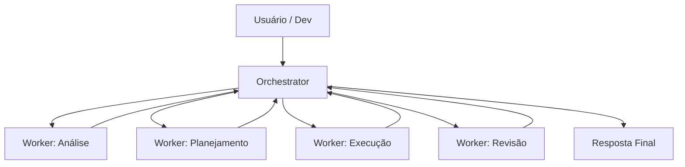
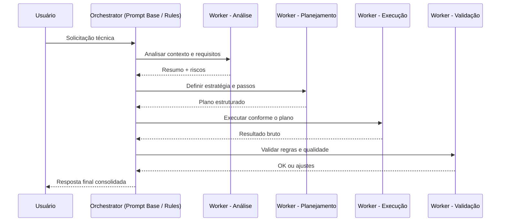
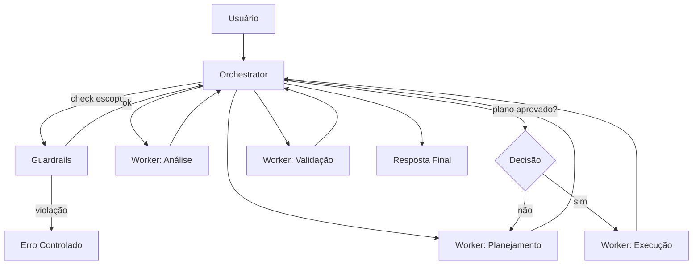

````markdown
# Arquitetura Orchestrator–Worker explicada com Mermaid

Este documento explica a **arquitetura Orchestrator–Worker** usando **diagramas Mermaid**, aplicada ao contexto de **IDEs com IA (ex: Cursor)** e sistemas agentic.  
A ideia é sair do abstrato e tornar o fluxo **visual, verificável e controlável**.

---

## 1️⃣ Visão macro — Modelo mental Orchestrator–Worker

Diagrama conceitual mínimo, independente de ferramenta.


````

### Leitura correta do diagrama

- O **Orchestrator** é o único ponto de entrada e saída.
- Workers **não conversam entre si**.
- Workers **não decidem próximos passos**.
- Toda decisão volta para o Orchestrator.

Esse é o padrão-base de:

- Master–Worker
- Planner–Executor
- Agentic AI moderno

---

## 2️⃣ Fluxo real dentro de uma IDE (Cursor / IDE com IA)

Agora o mesmo conceito aplicado ao uso prático dentro da IDE.



### Tradução direta para o Cursor

- **Orchestrator** → system prompt / rules
- **Workers** → roles, etapas, sub-prompts
- **Sequência** → Prompt Chaining
- **Validação** → Reflection / Verify

Nada disso exige código adicional — é **arquitetura cognitiva via prompt**.

---

## 3️⃣ Versão profissional — com Guardrails e Enforcement

Aqui entra o nível que evita alucinação, drift e execução indevida.



### Pontos críticos

- **Guardrails não são workers**
- Funcionam como um _firewall cognitivo_
- Se regras são violadas, o fluxo **não continua**
- O Orchestrator controla **quando executar** e **quando parar**

Esse padrão aparece em:

- LangGraph
- Plan-and-Execute agents
- Sistemas internos de agentes LLM

---

## 4️⃣ Mapeamento direto: Arquitetura → Cursor

| Conceito Arquitetural | Implementação no Cursor     |
| --------------------- | --------------------------- |
| Orchestrator          | Prompt base / rules         |
| Worker                | Role Prompting              |
| Sequência             | Prompt Chaining             |
| Validação             | Reflection / Verify         |
| Guardrails            | Constraint-based / Rules    |
| Decisão               | Perguntar antes de executar |

Você não “programa” isso — você **desenha comportamento**.

---

## 5️⃣ Regra de ouro

> **Se o modelo decide sozinho o que fazer a seguir,
> você NÃO tem um orchestrator.
> Você tem um improvisador.**

O Mermaid ajuda porque obriga a responder:

- Quem decide?
- Quem executa?
- Quem valida?
- Onde o fluxo pode parar?

---
