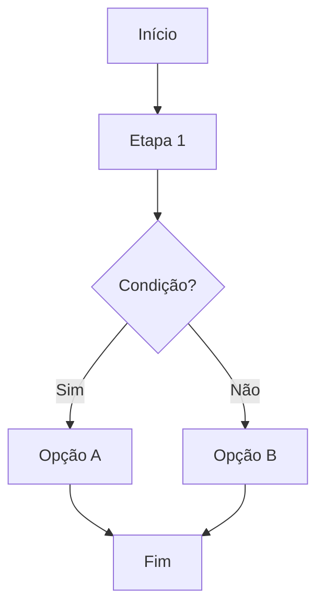

# Fluxos Determinísticos (LangGraph-style)

Define grafos de execução para garantir qualidade e evitar alucinações.

---

## O Que São Fluxos Determinísticos?

Workflows que seguem um grafo predefinido, garantindo que:

- ✅ Todas as etapas obrigatórias são executadas
- ✅ Validações não são puladas
- ✅ Erros são tratados sistematicamente
- ✅ Cada transição é registrada

**Inspirado em:** LangGraph (LangChain)

---

## Fluxo 1: Nova Feature Completa

```mermaid
graph TD
    Vision[Vision Document] --> PlanGlobal[Plano Global]
    PlanGlobal --> IdentifySkills{Quais Skills?}

    IdentifySkills -->|Frontend| ReactSkill[@react-patterns]
    IdentifySkills -->|Backend| BackendSkill[@backend-dev-guidelines]
    IdentifySkills -->|Both| ReactSkill
    IdentifySkills -->|Both| BackendSkill

    ReactSkill --> Implementation[Implementação]
    BackendSkill --> Implementation

    Implementation --> CodeReview[/code-review]

    CodeReview -->|Issues| CleanCode[@clean-code]
    CleanCode --> Implementation

    CodeReview -->|Pass| Security[/auditoria-seguranca]
    Security -->|Issues| FixSecurity[Corrigir]
    FixSecurity --> Security

    Security -->|Pass| Tests[/test-fix-all]
    Tests -->|Fail| FixTests[Corrigir Testes]
    FixTests --> Tests

    Tests -->|Pass| SyncDocs[/sync-docs-obsidian]
    SyncDocs --> CreatePR[/criar-pr]
    CreatePR --> End[Fim]
```

### Como usar:

```
Cursor, use o fluxo "Nova Feature Completa" para implementar:
- Feature: Sistema de notificações
- Stack: React + Node.js
```

A IA seguirá o grafo automaticamente, não pulando etapas.

---

## Fluxo 2: Refatoração de Código Legado

```mermaid
graph TD
    Start[Código Legado] --> Audit[@production-code-audit]
    Audit --> PlanRefactor[Plano de Refatoração]

    PlanRefactor --> Parallel{Paralelizar?}
    Parallel -->|Sim| Module1[Módulo 1]
    Parallel -->|Sim| Module2[Módulo 2]
    Parallel -->|Sim| Module3[Módulo 3]

    Module1 --> Merge[Merge + Review]
    Module2 --> Merge
    Module3 --> Merge

    Merge --> Integration[Testes Integração]
    Integration -->|Fail| Debug[@typescript-expert]
    Debug --> Integration

    Integration -->|Pass| DocADR[Gerar ADR]
    DocADR --> Obsidian[Salvar Obsidian MCP]
    Obsidian --> Done[Concluído]
```

### Como usar:

```
Cursor, refatore o módulo de autenticação usando o fluxo "Refatoração de Código Legado"
```

---

## Fluxo 3: Bug Fix Crítico

```mermaid
graph TD
    Bug[Bug Reportado] --> Reproduce[Reproduzir Bug]
    Reproduce -->|Não reproduz| Close[Fechar Issue]
    Reproduce -->|Reproduz| Analyze[@debugging]

    Analyze --> Identify[Identificar Causa]
    Identify --> Fix[Implementar Fix]

    Fix --> Tests[/test-fix-all]
    Tests -->|Fail| Fix

    Tests -->|Pass| Regression[Testes de Regressão]
    Regression -->|Fail| Fix

    Regression -->|Pass| Security[/auditoria-seguranca]
    Security -->|Issues| Fix

    Security -->|Pass| DocADR[Documentar ADR]
    DocADR --> HotfixPR[/criar-pr hotfix]
    HotfixPR --> Deploy[Deploy Urgente]
```

### Como usar:

```
Cursor, corrija o bug #123 usando o fluxo "Bug Fix Crítico"
```

---

## Fluxo 4: Code Review Sistemático

```mermaid
graph TD
    Start[Código Submetido] --> AutoReview[/code-review]

    AutoReview --> Quality{Qualidade?}
    Quality -->|Baixa| CleanCode[@clean-code]
    CleanCode --> AutoReview

    Quality -->|OK| Security[/auditoria-seguranca]
    Security -->|Issues| FixSec[Corrigir Segurança]
    FixSec --> Security

    Security -->|Pass| Performance[@performance-check]
    Performance -->|Issues| Optimize[Otimizar]
    Optimize --> Performance

    Performance -->|Pass| Tests[Rodar Testes]
    Tests -->|Fail| FixTests[Corrigir Testes]
    FixTests --> Tests

    Tests -->|Pass| Approve[Aprovar]
```

### Como usar:

```
/code-review (automático, segue o grafo)
```

---

## Fluxo 5: Handoff Multiagente

```mermaid
graph TD
    Task[Tarefa Complexa] --> Analyze[Analisar Requisitos]

    Analyze --> SelectSkills[Identificar Skills]

    SelectSkills --> Agent1[@skill-1]
    SelectSkills --> Agent2[@skill-2]
    SelectSkills --> Agent3[@skill-3]

    Agent1 --> Result1[Resultado 1]
    Agent2 --> Result2[Resultado 2]
    Agent3 --> Result3[Resultado 3]

    Result1 --> Combine[Combinar Resultados]
    Result2 --> Combine
    Result3 --> Combine

    Combine --> Validate[Validar Coerência]
    Validate -->|Issues| Agent1

    Validate -->|OK| FinalReview[/code-review]
    FinalReview --> Done[Concluído]
```

### Como usar:

```
/handoff implementar sistema de autenticação
```

---

## Como Funciona Internamente?

### 1. Definir Grafo no Início:

```python
# Pseudo-código interno do Cursor
workflow = {
    "name": "nova-feature",
    "nodes": {
        "vision": {"type": "document", "path": "docs/VISION.md"},
        "plan": {"type": "prompt", "template": "Plano Global"},
        "identify_skills": {"type": "decision"},
        "implementation": {"type": "skill", "skills": ["@react-patterns"]},
        "code_review": {"type": "command", "command": "/code-review"},
        # ...
    },
    "edges": [
        {"from": "vision", "to": "plan"},
        {"from": "plan", "to": "identify_skills"},
        # ...
    ]
}
```

### 2. Cursor Segue Grafo Automaticamente:

```python
current_node = "vision"

while current_node != "end":
    # Executar nó atual
    result = execute_node(workflow.nodes[current_node])

    # Registrar métrica
    metrics_tracker.log_node(current_node, result)

    # Validar condições de saída
    if not validate_node_output(result):
        raise ValidationError(f"Node {current_node} failed validation")

    # Próximo nó
    next_nodes = workflow.get_edges(current_node)

    if len(next_nodes) == 1:
        current_node = next_nodes[0]
    else:
        # Decisão condicional
        current_node = decide_next_node(result, next_nodes)
```

### 3. Validação em Pontos de Checagem:

```python
def validate_code_review(result):
    """Validar que code review passou"""
    if result.issues_count > 0:
        return False
    if result.security_score < 8:
        return False
    return True

# No grafo
if not validate_code_review(code_review_result):
    # Volta para implementation
    current_node = "implementation"
else:
    # Avança para security
    current_node = "security"
```

---

## Benefícios:

### 1. Qualidade Consistente

- Fluxo obrigatório garante todas as validações
- Impossível pular etapas críticas (testes, security)
- Padrão seguido em todos os projetos

### 2. Rastreabilidade

- Log completo de cada nó visitado
- Métricas em cada transição
- Auditoria de decisões

### 3. Previsibilidade

- Sempre os mesmos steps para mesma tarefa
- Estimativas mais precisas
- Debugging mais fácil (sabe onde falhou)

### 4. Zero Alucinações

- Grafo força IA a seguir lógica
- Validações impedem outputs inválidos
- Rollback automático em falhas

---

## Criar Seu Próprio Fluxo

### Template:

````markdown
## Fluxo: [Nome]


````

### Como usar:

[Instruções para invocar o fluxo]

---

```

### Salvar em:

```

.cursor/Prompts/Architecture/workflows/meu-fluxo.md

```

### Usar:

```

Cursor, use o fluxo "meu-fluxo" para [tarefa]

````

---

## Integração com Métricas

Cada nó do grafo registra métricas:

```python
metrics_tracker.log_workflow(
    workflow_name="nova-feature",
    skills_used=["@react-patterns", "@backend-dev-guidelines"],
    total_tokens=45000,
    duration=420,
    success=True
)
````

Visualize com:

```
/metrics-report week
```

---

## Integração com Obsidian

Salve ADRs de workflows:

```
Workflow executado: "Nova Feature Completa"
       ↓
ADR gerado automaticamente
       ↓
/sync-docs-obsidian
       ↓
Obsidian/Workflows/feature-auth.md
```

---

## Troubleshooting

### Problema: "Workflow preso em loop"

**Solução:**

- Adicionar contador de tentativas
- Forçar saída após N iterações

```python
max_retries = 3
retry_count = 0

while not success and retry_count < max_retries:
    result = execute_node()
    retry_count += 1
```

### Problema: "Validação muito rígida"

**Solução:**

- Ajustar thresholds de validação
- Adicionar bypass manual

```python
if not validate(result):
    if user_approves_override():
        # Continuar mesmo assim
        pass
    else:
        # Voltar e corrigir
        retry()
```

---

## Exemplos Práticos

### Exemplo 1: Feature de Login

```
Cursor, implemente feature de login usando fluxo "Nova Feature Completa"
```

**Resultado:**

1. ✅ Vision checked
2. ✅ Plano global criado
3. ✅ Skills identificadas: @backend-dev-guidelines, @react-patterns, @security-review
4. ✅ Implementação (3 handoffs)
5. ✅ Code review (94% score)
6. ✅ Security audit (0 issues)
7. ✅ Testes (100% pass)
8. ✅ Docs sincronizadas
9. ✅ PR criado

**Tempo total:** 12 minutos  
**Custo:** $2.35

### Exemplo 2: Refatoração de API

```
Cursor, refatore /api/users usando fluxo "Refatoração de Código Legado"
```

**Resultado:**

1. ✅ Audit realizado (encontrou 12 issues)
2. ✅ Plano de refatoração (3 módulos)
3. ✅ Paralelização (3 branches)
4. ✅ Merge + review
5. ✅ Testes de integração (98% pass)
6. ✅ ADR gerado
7. ✅ Sincronizado Obsidian

**Tempo total:** 25 minutos  
**Custo:** $4.80

---

## Próximos Passos

1. ✅ Defina fluxos para seus casos de uso comuns
2. ✅ Use `workflow_validator.py` para garantir integridade
3. ✅ Monitore com `/metrics-report`
4. ✅ Itere e otimize baseado em métricas

---

**Status**: Fluxos determinísticos prontos para uso! 📊
