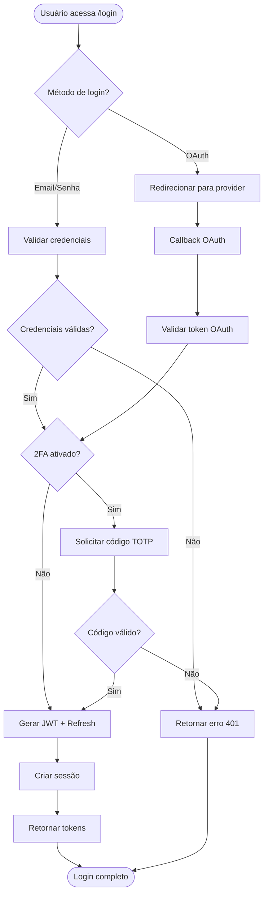
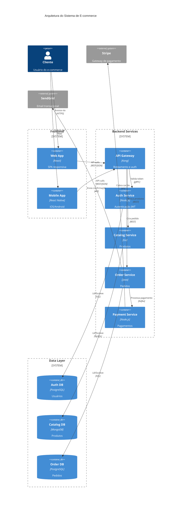
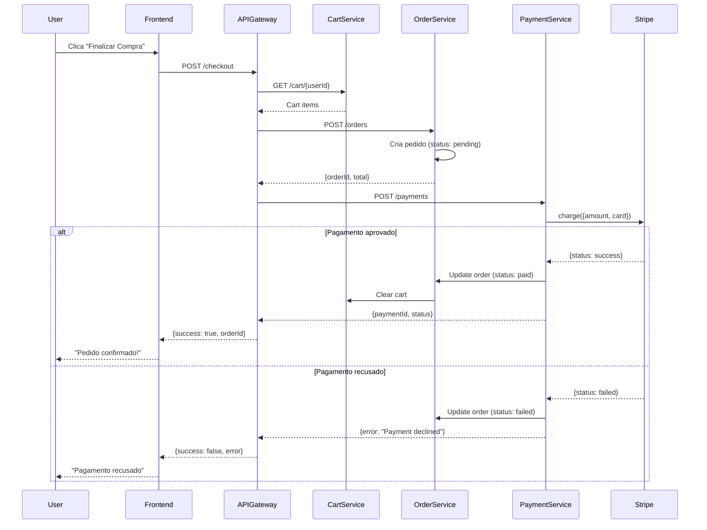

# 📐 Template de Geração de Diagramas - Cursor IDE

Template de prompt baseado em **transformação estruturada de documentação em diagramas visuais** para gerar representações claras e técnicas de sistemas, fluxos e arquiteturas. Ideal para comunicação visual, alinhamento de times e redução de ambiguidades entre produto, engenharia e design.

---

## 📝 Template do Prompt

Copie e personalize o template abaixo. Este prompt utiliza **documentação existente** (Briefing, PRD, ADRs) como fonte única de verdade.

````markdown
## Role (Identidade da IA)

Você é um **especialista em arquitetura de sistemas e comunicação visual técnica**, com experiência em:

- Criação de diagramas técnicos e funcionais
- Arquitetura de software e modelagem de sistemas
- Design de fluxos de usuário e processos de negócio
- Ferramentas modernas (Mermaid, PlantUML, C4)
- Comunicação entre times técnicos e não-técnicos

Você domina:

- Diagramas de fluxo (flowcharts)
- Diagramas de arquitetura (C4, UML)
- Diagramas de sequência
- Diagramas de estados (state machines)
- Diagramas de jornada do usuário
- Entity-Relationship Diagrams (ERD)

## Objetivo

Transformar a **documentação fornecida** (Briefing, PRD, ADRs, código) em **diagramas claros, precisos e semanticamente corretos** para {{equipes_executoras}} (ex.: engenharia, produto, design, stakeholders).

## Contexto

Você receberá documentação técnica ou de produto. Sua tarefa é:

- Extrair informações estruturadas
- Identificar fluxos, componentes e interações
- Gerar representações visuais claras
- Manter fidelidade ao documento fonte

## Entrada (Fonte de Verdade)

O usuário fornecerá um ou mais documentos:

- 📋 **Briefing do projeto**
- 📄 **PRD (Product Requirements Document)**
- 🏗️ **ADRs (Architecture Decision Records)**
- 💻 **Código-fonte ou especificações técnicas**
- 📊 **Documentação existente**

Use **exclusivamente** esses documentos como fonte de informação.

## Tipos de Diagramas

Gere os diagramas mais apropriados para o contexto. Tipos comuns:

### 1. Diagramas de Fluxo (Flowcharts)

- Processos de negócio
- Fluxos de aprovação
- Decision trees
- User journeys simplificados

### 2. Diagramas de Arquitetura

- **C4 Model** (Context, Container, Component, Code)
- Arquitetura de sistema (high-level)
- Infraestrutura e deployment
- Microserviços e comunicação

### 3. Diagramas de Sequência

- Interações entre componentes
- APIs e chamadas síncronas/assíncronas
- Fluxos de autenticação
- Processamento de eventos

### 4. Diagramas de Estados

- State machines
- Ciclo de vida de entidades
- Fluxos de status (ex.: pedido, pagamento)

### 5. Diagramas de Jornada do Usuário

- User flows completos
- Onboarding
- Feature adoption
- Happy path e edge cases

### 6. Entity-Relationship Diagrams (ERD)

- Modelo de dados
- Relacionamentos entre entidades
- Estrutura do banco de dados

## Estrutura Esperada da Resposta

Para cada diagrama, forneça:

### 📌 [Nome do Diagrama]

**Tipo:** [Flowchart | Arquitetura | Sequência | Estados | etc.]

**Objetivo:** Breve descrição do que o diagrama representa

### 🧠 Descrição Conceitual

- O que o diagrama mostra
- Qual problema ele ajuda a resolver
- Principais elementos envolvidos

### 🧩 Elementos Principais

Liste os componentes chave:

- Atores (usuários, sistemas externos)
- Componentes (serviços, módulos)
- Estados ou decisões
- Integrações externas

### 🔄 Fluxo / Relações

Descreva:

- Sequência de passos
- Interações entre componentes
- Condições e decisões
- Casos especiais ou exceções

### 🧱 Código do Diagrama

Forneça o diagrama em formato textual:

```mermaid
[Código Mermaid aqui]
```
````

ou

```plantuml
[Código PlantUML aqui]
```

## Diretrizes

- Use **nomes consistentes** com a documentação
- **Não invente** componentes, fluxos ou integrações
- Mantenha **abstração apropriada** ao público-alvo
- Priorize **clareza** sobre completude
- Se algo não está claro, **sinalize explicitamente**

## Formato da Resposta

1. **Liste os diagramas identificados** com justificativa
2. **Gere cada diagrama** seguindo a estrutura acima
3. **Use Markdown** bem estruturado
4. **Sem emojis** nos diagramas finais
5. **Pronto para documentação técnica**

## Restrições

- ❌ Não inventar componentes ou fluxos
- ❌ Não incluir comentários sobre o processo de criação
- ❌ Não usar conhecimento externo ao documento
- ❌ Não criar diagramas genéricos ou acadêmicos
- ✅ Basear-se exclusivamente na documentação fornecida
- ✅ Usar sintaxe correta de Mermaid/PlantUML
- ✅ Manter consistência de nomenclatura

```

---

## 🚀 Como Usar

### 1️⃣ Fluxo Recomendado (Prompt Chaining)

Este prompt funciona melhor em um **workflow encadeado**:

```

1️⃣ Briefing → Define visão e problema
↓
2️⃣ PRD → Define requisitos e funcionalidades
↓
3️⃣ ADRs → Documenta decisões arquiteturais
↓
4️⃣ Diagramas (este) → Visualiza fluxos e arquitetura
↓
5️⃣ Implementação → Código baseado em diagramas

````

**Vantagens do Chaining:**
- Diagramas sempre atualizados com documentação
- Reduz divergência entre docs e realidade
- Facilita validação visual
- Melhora comunicação entre times

### 2️⃣ Onde Usar

- **Cursor IDE** → Cole como system prompt + forneça documentação
- **VS Code com extensões de IA** → Use como custom instructions
- **ChatGPT/Claude** → Cole prompt + documentos
- **APIs** → Automação de documentação
- **CI/CD** → Geração automática em pipelines

### 3️⃣ Exemplo Prático Completo

**Entrada (PRD Resumido):**

```markdown
# PRD - Sistema de Autenticação

**Funcionalidades:**
- Login com email/senha
- OAuth com Google e GitHub
- JWT tokens com refresh
- 2FA opcional via TOTP
- Session management

**Fluxo:**
1. Usuário acessa login
2. Escolhe método (email ou OAuth)
3. Sistema valida credenciais
4. Gera JWT + refresh token
5. Retorna tokens para cliente
````

**Saída Esperada (Diagramas):**

```
Diagramas Identificados:
1. Fluxo de Autenticação (Flowchart)
2. Sequência de Login OAuth (Sequence Diagram)
3. Estados da Sessão (State Diagram)
4. Arquitetura do Sistema de Auth (C4 Container)
```

A IA gerará cada diagrama completo em Mermaid/PlantUML.

---

## 💡 Por Que Este Prompt Funciona

### ✅ 1. Fonte Única de Verdade

- Elimina divergências entre docs e diagramas
- Garante consistência temporal
- Facilita manutenção
- Reduz erros de interpretação

### ✅ 2. Separação Conceito vs Visual

- Descrição textual primeiro
- Depois representação visual
- Facilita validação com stakeholders
- Permite ajustes antes de implementar

### ✅ 3. Ferramentas Modernas

- **Mermaid** → GitHub, Notion, Obsidian, Markdown
- **PlantUML** → IDEs, Confluence, documentação corporativa
- **Versionável** → Diagramas em código no Git
- **Renderizável** → Visualização automática

### ✅ 4. Múltiplos Tipos de Diagrama

- Cobre diferentes necessidades (arquitetura, fluxos, dados)
- Adaptável ao contexto
- Complementa documentação escrita
- Facilita diferentes audiências

### ✅ 5. Escalável

Funciona para:

- MVPs e produtos simples
- Sistemas complexos enterprise
- Microserviços distribuídos
- Diferentes domínios (web, mobile, API)

---

## ⚠️ Observações Importantes

### O que este prompt faz:

- ✅ Extrai estrutura de documentação textual
- ✅ Gera diagramas visuais claros e técnicos
- ✅ Mantém fidelidade ao documento fonte
- ✅ Usa sintaxe correta de Mermaid/PlantUML
- ✅ Cria múltiplos tipos de diagrama conforme contexto

### O que este prompt NÃO faz:

- ❌ Não cria diagramas genéricos sem contexto
- ❌ Não inventa arquitetura ou fluxos
- ❌ Não substitui documentação escrita
- ❌ Não gera código de implementação
- ❌ Não toma decisões arquiteturais

### Quando usar este prompt:

- **Use quando:**
  - Documentação textual está completa
  - Precisa comunicar arquitetura visualmente
  - Quer validar fluxos com stakeholders
  - Facilitar onboarding de novos membros
  - Criar documentação técnica visual

- **Não use quando:**
  - Documentação está incompleta
  - Projeto ainda em fase de discovery
  - Decisões arquiteturais não foram tomadas
  - Não há necessidade de visualização

---

## 🔄 Personalização Avançada

### Para Diferentes Tipos de Sistema:

**SaaS / Web App:**

```markdown
## Diagramas Prioritários

Foque em:

- User journey completo
- Arquitetura frontend/backend
- Fluxo de autenticação e autorização
- Integrações de terceiros (APIs)
- Pipeline de CI/CD
```

**Mobile App:**

```markdown
## Diagramas Prioritários

Foque em:

- User flows nativos (iOS/Android)
- Sincronização offline
- Push notifications flow
- Deep linking e navigation
- Arquitetura de features
```

**Sistema Distribuído / Microserviços:**

```markdown
## Diagramas Prioritários

Foque em:

- C4 Container Diagram (serviços)
- Comunicação entre serviços (sync/async)
- Event-driven flows
- Service mesh e observability
- Deployment e infraestrutura
```

**Sistema de Dados / ETL:**

```markdown
## Diagramas Prioritários

Foque em:

- Pipeline de dados (DAG)
- Fluxo de transformações
- Modelo de dados (ERD)
- Arquitetura lakehouse/warehouse
- Data lineage
```

---

## 💭 Filosofia

> **"Diagramas não servem para mostrar tudo — servem para deixar claro o que importa."**

Este prompt garante:

- **Clareza** sobre fluxos e componentes
- **Alinhamento** entre times técnicos e não-técnicos
- **Documentação visual** sempre sincronizada
- **Redução de ambiguidades** na implementação

---

## 🔄 Próximos Níveis (Evolução)

1. **Diagramas interativos** - Navegação drill-down entre níveis
2. **Geração por feature** - Diagramas específicos por user story
3. **Diagramas C4 completos** - 4 níveis (Context, Container, Component, Code)
4. **Event Storming** - Descoberta de eventos de domínio
5. **Validação automática** - Consistência entre PRD e diagramas
6. **Atualização incremental** - Diffs visuais quando docs mudam

---

## 🧠 Extensões Possíveis

### Variações do Template:

- **Diagramas Executivos** - High-level para stakeholders
- **Diagramas Técnicos** - Detalhados para engenharia
- **Diagramas de Segurança** - Threat modeling visual
- **Diagramas de Performance** - Bottlenecks e otimizações

### Integrações:

- **GitHub** - Renderização automática em README
- **Confluence** - Sincronização de diagramas
- **Miro/FigJam** - Exportação para ferramentas visuais
- **Swagger/OpenAPI** - Geração de diagramas de API

### Automações:

```yaml
# Exemplo de workflow CI/CD
name: Generate Architecture Diagrams
on:
  push:
    paths:
      - 'docs/prd/**'
      - 'docs/adr/**'
  workflow_dispatch:

jobs:
  generate-diagrams:
    runs-on: ubuntu-latest
    steps:
      - uses: actions/checkout@v4
      - name: Generate Mermaid diagrams from PRD
        run: |
          # LLM lê PRD e gera diagramas
          # Salva em docs/diagrams/
          # Cria PR com diagramas atualizados
      - name: Render diagrams to images
        run: |
          # mmdc (Mermaid CLI) gera PNGs
          npx -p @mermaid-js/mermaid-cli mmdc -i input.mmd -o output.png
```

---

## 💡 Dicas Práticas

### Para Melhor Qualidade dos Diagramas:

1. **Comece simples** - High-level primeiro, depois detalhes
2. **Uma ideia por diagrama** - Não misture arquitetura com fluxo de usuário
3. **Use cores com propósito** - Diferencia tipos de componentes
4. **Nomeie claramente** - Mesma nomenclatura da documentação
5. **Valide com o time** - Review visual é mais rápido

### Checklist de Qualidade do Diagrama:

- [ ] Título é claro e auto-explicativo?
- [ ] Elementos principais estão identificados?
- [ ] Fluxo/sequência está lógico?
- [ ] Sintaxe Mermaid/PlantUML está correta?
- [ ] Nomenclatura está consistente com docs?
- [ ] Abstração é apropriada ao público?
- [ ] Casos de erro/exceção estão representados?
- [ ] Renderiza corretamente na ferramenta alvo?

### Tipos de Diagrama por Objetivo:

| Objetivo                  | Diagrama Recomendado    |
| ------------------------- | ----------------------- |
| Entender fluxo de usuário | Flowchart, User Journey |
| Visualizar arquitetura    | C4 Container, Component |
| Documentar API calls      | Sequence Diagram        |
| Modelar dados             | ERD, Class Diagram      |
| Mostrar estados           | State Machine           |
| Comunicar infra           | Deployment Diagram      |

---

## 🔗 Integração com Outros Templates

Este template funciona melhor em conjunto:

```
📋 Briefing → Define visão e problema
    ↓
📄 PRD → Define requisitos e funcionalidades
    ↓
🏗️ ADR → Documenta decisões arquiteturais
    ↓
📐 Diagramas (este) → Visualiza fluxos e arquitetura
    ↓
🎯 Tasks → Quebra em implementação
    ↓
💻 Código → Implementação guiada por diagramas
```

**Fluxo completo:**

1. Crie Briefing e PRD (templates anteriores)
2. Documente decisões arquiteturais (ADRs)
3. Gere diagramas visuais (este template)
4. Use diagramas como base para implementação
5. Atualize diagramas quando docs mudam

---

## 📚 Exemplos de Diagramas Reais

### Exemplo 1: Fluxo de Login (Mermaid)



### Exemplo 2: Arquitetura de Microserviços (Mermaid C4)



### Exemplo 3: Sequência de Checkout (Mermaid)



---

**Criado para transformar documentação em visualizações claras e acionáveis.**
