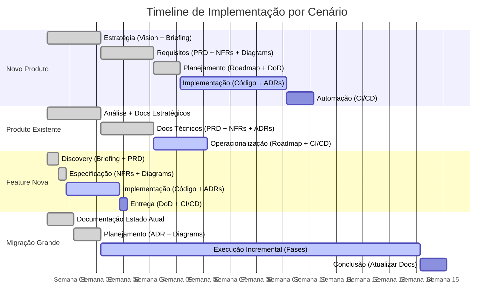
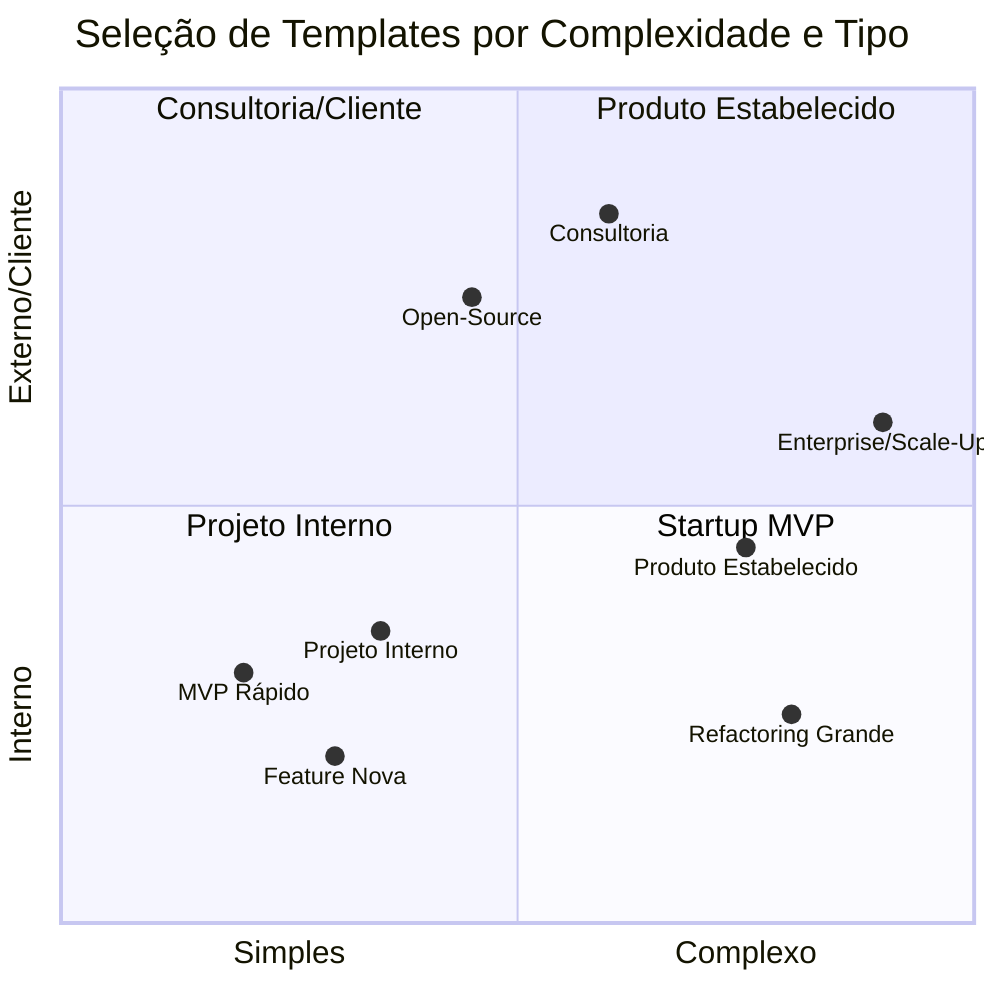
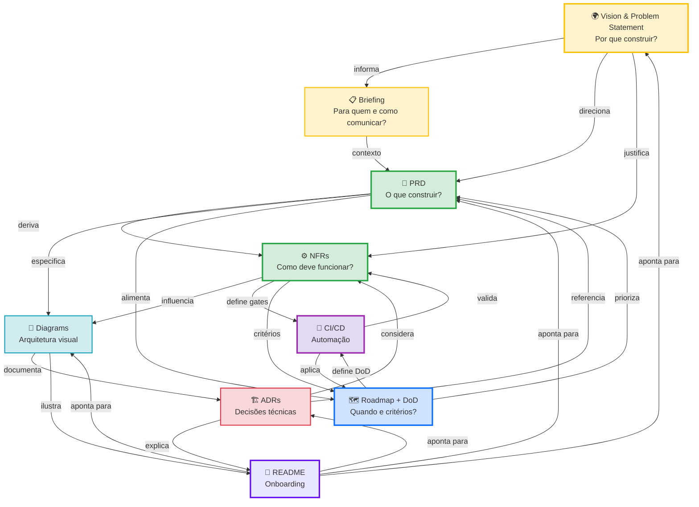

# 📚 Guia Completo do Workflow de Documentação Técnica

**Ecossistema completo de 9 templates para criar documentação técnica profissional** do conceito inicial até deploy automatizado. Este guia ensina como usar todos os templates em conjunto para construir produtos com documentação de classe mundial.

---

## 🎯 Visão Geral

Este workflow transforma uma **ideia de produto** em **documentação completa + código + pipeline automatizada** seguindo as melhores práticas da indústria.

### O Que Este Workflow Resolve

- ❌ **Problema:** Projetos começam sem clareza, documentação surge depois (ou nunca)
- ✅ **Solução:** Documentação estruturada desde o dia 1, evolui com o produto

- ❌ **Problema:** Cada projeto tem estrutura diferente, onboarding é caótico
- ✅ **Solução:** Templates padronizados, processo repetível e escalável

- ❌ **Problema:** Requisitos vagos, decisões não documentadas, conhecimento tribal
- ✅ **Solução:** Documentos formais, decisões rastreáveis, single source of truth

---

## 📊 Visualização do Workflow Completo

```mermaid
flowchart TD
    Start([💡 Ideia de Produto]) --> Phase1{Fase 1: ESTRATÉGIA}

    Phase1 --> Vision[🌍 Vision & Problem Statement<br/>Semana 1-2<br/>Por que construir?]
    Vision --> Briefing[📋 Briefing<br/>Semana 1-2<br/>Contexto e restrições]

    Briefing --> Phase2{Fase 2: REQUISITOS}

    Phase2 --> PRD[📄 PRD<br/>Semana 2-4<br/>O que construir?]
    Phase2 --> NFRs[⚙️ NFRs<br/>Semana 2-4<br/>Como deve funcionar?]

    PRD --> Diagrams[📐 Diagrams<br/>Semana 3-4<br/>Arquitetura visual]
    NFRs --> Diagrams

    Diagrams --> Phase3{Fase 3: PLANEJAMENTO}

    Phase3 --> Roadmap[🗺️ Roadmap + DoD<br/>Semana 4-5<br/>Quando e o que é pronto?]

    Roadmap --> Phase4{Fase 4: IMPLEMENTAÇÃO}

    Phase4 --> Code([💻 Código<br/>Semana 5+<br/>Desenvolvimento])
    Code --> ADR[🏗️ ADRs<br/>Durante implementação<br/>Decisões técnicas]
    Code --> README[📘 README<br/>Durante implementação<br/>Onboarding]

    README --> Phase5{Fase 5: AUTOMAÇÃO}
    ADR --> Phase5

    Phase5 --> CICD[🔄 CI/CD<br/>Antes de produção<br/>Deploy automatizado]

    CICD --> Production([🚀 Produção])

    Production --> Monitoring[📊 Monitoramento<br/>Pós-deploy<br/>Observabilidade]

    style Start fill:#e1f5ff
    style Vision fill:#fff3cd
    style Briefing fill:#fff3cd
    style PRD fill:#d4edda
    style NFRs fill:#d4edda
    style Diagrams fill:#d4edda
    style Roadmap fill:#cfe2ff
    style Code fill:#f8d7da
    style ADR fill:#f8d7da
    style README fill:#f8d7da
    style CICD fill:#e2d9f3
    style Production fill:#d1e7dd
    style Monitoring fill:#d1e7dd

    style Phase1 fill:#ffc107,stroke:#ff9800,stroke-width:3px
    style Phase2 fill:#4caf50,stroke:#2e7d32,stroke-width:3px
    style Phase3 fill:#2196f3,stroke:#1565c0,stroke-width:3px
    style Phase4 fill:#f44336,stroke:#c62828,stroke-width:3px
    style Phase5 fill:#9c27b0,stroke:#6a1b9a,stroke-width:3px
```



### 🎨 Legenda do Diagrama

**Cores por Fase:**

- 🟡 **Amarelo** - Fase 1: Estratégia (Semana 1-2)
- 🟢 **Verde** - Fase 2: Requisitos (Semana 2-4)
- 🔵 **Azul** - Fase 3: Planejamento (Semana 4-5)
- 🔴 **Vermelho** - Fase 4: Implementação (Semana 5+)
- 🟣 **Roxo** - Fase 5: Automação (Antes de produção)

**Símbolos:**

- 📄 Documentos de entrada/saída
- 💎 Fases do processo
- ➡️ Fluxo sequencial
- ⚙️ Processos paralelos

---

## 📦 Os 9 Templates do Ecossistema

### 1. 🌍 Vision & Problem Statement

**O que é:** Definição estratégica do produto
**Quando usar:** Primeiro documento, antes de qualquer código
**Output:** Visão, problema, público-alvo, anti-problema

### 2. 📋 Briefing

**O que é:** Contexto detalhado do projeto
**Quando usar:** Logo após Vision, antes de PRD
**Output:** Objetivos, tom, mensagem-chave, restrições

### 3. 📄 PRD (Product Requirements Document)

**O que é:** Requisitos funcionais completos
**Quando usar:** Após Vision + Briefing, antes de implementar
**Output:** Features, user flows, critérios de aceitação, escopo

### 4. ⚙️ NFRs (Non-Functional Requirements)

**O que é:** Requisitos de qualidade (performance, segurança, etc)
**Quando usar:** Em paralelo com PRD ou logo após
**Output:** Métricas de performance, SLAs, security requirements

### 5. 📐 Diagrams

**O que é:** Visualizações técnicas da arquitetura
**Quando usar:** Após PRD, antes ou durante implementação
**Output:** C4 diagrams, fluxogramas, diagramas de sequência, ERDs

### 6. 🏗️ ADRs (Architecture Decision Records)

**O que é:** Registro de decisões técnicas importantes
**Quando usar:** Durante implementação, sempre que decisão importante for tomada
**Output:** Contexto, decisão, consequências, alternativas

### 7. 🗺️ Roadmap + DoD (Definition of Done)

**O que é:** Planejamento temporal + critérios de conclusão
**Quando usar:** Após PRD e NFRs, antes de sprints
**Output:** Timeline (Now/Next/Later), DoD checklist, priorizações

### 8. 📘 README

**O que é:** Porta de entrada do projeto, guia de onboarding
**Quando usar:** Após primeiros commits, atualizar continuamente
**Output:** Overview, setup, arquitetura, contribuição

### 9. 🔄 CI/CD

**O que é:** Pipeline automatizada de qualidade e deploy
**Quando usar:** Após código funcional, antes de produção
**Output:** Workflows, quality gates, deploy automation

---

## 🔄 Fluxos de Uso Recomendados

### 🗺️ Comparação Visual dos 4 Cenários

```mermaid
graph LR
    subgraph Cenario1["🆕 Cenário 1: Novo Produto (Greenfield)"]
        G1[Vision] --> G2[Briefing] --> G3[PRD + NFRs] --> G4[Diagrams]
        G4 --> G5[Roadmap] --> G6[Código] --> G7[ADRs + README]
        G7 --> G8[CI/CD] --> G9[Produção]
    end

    subgraph Cenario2["📚 Cenário 2: Produto Existente (Retroativo)"]
        R1[Análise] --> R2[Vision Retroativo] --> R3[PRD + NFRs]
        R3 --> R4[Diagrams da Arquitetura Atual] --> R5[ADRs Passados]
        R5 --> R6[Roadmap Futuro] --> R7[README] --> R8[CI/CD]
    end

    subgraph Cenario3["✨ Cenário 3: Feature Nova"]
        F1[Briefing Feature] --> F2[Atualizar PRD] --> F3[Atualizar NFRs]
        F3 --> F4[Diagrams Fluxos] --> F5[Código] --> F6[ADR]
        F6 --> F7[Atualizar README] --> F8[CI/CD Deploy]
    end

    subgraph Cenario4["🔄 Cenário 4: Migração/Refactoring"]
        M1[ADR Estado Atual] --> M2[Diagrams Before] --> M3[ADR Strategy]
        M3 --> M4[Diagrams After] --> M5[Roadmap Migração]
        M5 --> M6[Fases Incrementais] --> M7[ADRs por Fase]
        M7 --> M8[Atualizar Docs] --> M9[ADR Completed]
    end

    style Cenario1 fill:#e8f5e9,stroke:#4caf50,stroke-width:2px
    style Cenario2 fill:#e3f2fd,stroke:#2196f3,stroke-width:2px
    style Cenario3 fill:#fff3e0,stroke:#ff9800,stroke-width:2px
    style Cenario4 fill:#f3e5f5,stroke:#9c27b0,stroke-width:2px
```



### ⏱️ Timeline Comparativa



---

### Fluxo 1: Novo Produto (Greenfield)

```
Fase 1: ESTRATÉGIA (Semana 1-2)
├─ 1. Vision & Problem Statement
├─ 2. Briefing
└─ Output: Clareza sobre O QUÊ construir e POR QUÊ

Fase 2: REQUISITOS (Semana 2-4)
├─ 3. PRD (requisitos funcionais)
├─ 4. NFRs (requisitos de qualidade)
├─ 5. Diagrams (arquitetura inicial)
└─ Output: Clareza sobre COMO construir

Fase 3: PLANEJAMENTO (Semana 4-5)
├─ 7. Roadmap + DoD
└─ Output: Clareza sobre QUANDO e O QUE É "PRONTO"

Fase 4: IMPLEMENTAÇÃO (Semana 5+)
├─ Código (desenvolvimento)
├─ 6. ADRs (conforme decisões são tomadas)
├─ 8. README (documentação viva)
└─ Output: Produto funcional + decisões documentadas

Fase 5: AUTOMAÇÃO (Antes de Produção)
├─ 9. CI/CD
└─ Output: Deploy automatizado e seguro
```

**Timeline Total:** 8-12 semanas para MVP com documentação completa

---

### Fluxo 2: Produto Existente (Documentação Retroativa)

```
Fase 1: ANÁLISE (Semana 1)
├─ Análise de código existente
├─ Entrevistas com time
└─ Output: Entendimento do estado atual

Fase 2: DOCUMENTAÇÃO ESTRATÉGICA (Semana 1-2)
├─ 1. Vision & Problem Statement (reconstruir)
├─ 2. Briefing (contexto histórico)
└─ Output: Fundação estratégica documentada

Fase 3: DOCUMENTAÇÃO TÉCNICA (Semana 2-4)
├─ 3. PRD (documentar features existentes)
├─ 4. NFRs (extrair dos requisitos implícitos)
├─ 5. Diagrams (mapear arquitetura atual)
├─ 6. ADRs (documentar decisões passadas)
└─ Output: Estado atual documentado

Fase 4: OPERACIONALIZAÇÃO (Semana 4-6)
├─ 7. Roadmap + DoD (futuro + padrões)
├─ 8. README (onboarding)
├─ 9. CI/CD (se não existir)
└─ Output: Produto documentado + processos definidos
```

**Timeline Total:** 6-8 semanas para documentar produto existente

---

### Fluxo 3: Feature Nova (Produto Existente)

```
Fase 1: DISCOVERY (Dias 1-3)
├─ Atualizar Vision (se necessário)
├─ Criar Briefing da feature
└─ Output: Feature alinhada com estratégia

Fase 2: ESPECIFICAÇÃO (Dias 3-5)
├─ Atualizar PRD (adicionar nova feature)
├─ Atualizar NFRs (requisitos da feature)
├─ Criar Diagrams (fluxos novos)
└─ Output: Feature especificada

Fase 3: IMPLEMENTAÇÃO (Semana 2-4)
├─ Desenvolvimento
├─ Criar ADRs (decisões técnicas)
├─ Atualizar README (se necessário)
└─ Output: Feature implementada + documentada

Fase 4: ENTREGA (Dias finais)
├─ Validar DoD
├─ CI/CD deploya automaticamente
└─ Output: Feature em produção
```

**Timeline Total:** 2-4 semanas para feature média

---

### Fluxo 4: Migração/Refatoração Grande

```
Fase 1: DOCUMENTAÇÃO DO ESTADO ATUAL (Semana 1)
├─ ADR: "Current State Architecture"
├─ Diagrams: Estado atual
└─ Output: Baseline documentado

Fase 2: PLANEJAMENTO (Semana 1-2)
├─ ADR: "Migration Strategy" (proposta)
├─ Diagrams: Estado futuro
├─ Atualizar Roadmap
└─ Output: Plano de migração aprovado

Fase 3: EXECUÇÃO INCREMENTAL (Meses)
├─ ADRs para cada fase
├─ Atualizar Diagrams progressivamente
├─ Atualizar README conforme muda
└─ Output: Migração documentada passo a passo

Fase 4: CONCLUSÃO
├─ ADR: "Migration Completed"
├─ Atualizar todos os docs
└─ Output: Nova arquitetura documentada
```

**Timeline Total:** Depende da complexidade (3-12 meses)

---

## 🎓 Guia de Uso Detalhado

### 1️⃣ Vision & Problem Statement

**📁 Localização:** `.cursor/Prompts/Prompt-Documetations/Vision-Problem=Statement/Prompt-Vision-PS.md`

**Quando Usar:**

- ✅ Início de novo produto
- ✅ Pivot estratégico
- ✅ Precisa alinhar stakeholders
- ✅ Perdeu clareza sobre "por quê"

**Como Usar:**

1. Leia o template
2. Forneça contexto: mercado, usuários, problema observado
3. IA gera Vision & Problem Statement estruturado
4. Revise e ajuste com stakeholders
5. Use como norte estratégico

**Exemplo de Entrada:**

```
Contexto: E-commerce de nicho (produtos artesanais)
Problema: Artesãos não conseguem vender online facilmente
Usuários: Artesãos locais (50-60 anos, baixa tech literacy)
```

**Output Esperado:**

- Vision statement claro
- Problem statement estruturado
- Target audience detalhado
- Anti-problem (o que NÃO é)
- Assumptions e constraints

**Próximo Passo:** Briefing

---

### 2️⃣ Briefing

**📁 Localização:** `.cursor/Prompts/Prompt-Documetations/Briefing/Prompt-Briefing.md`

**Quando Usar:**

- ✅ Após Vision
- ✅ Antes de PRD
- ✅ Precisa alinhar tom e mensagem
- ✅ Comunicação com stakeholders não-técnicos

**Como Usar:**

1. Forneça Vision + contexto adicional
2. IA gera Briefing estruturado
3. Revise tom, mensagem-chave, restrições
4. Valide com marketing/produto

**Output Esperado:**

- Objetivos claros
- Público-alvo detalhado
- Tom e voz
- Mensagem-chave
- Restrições e prazos

**Próximo Passo:** PRD

---

### 3️⃣ PRD (Product Requirements Document)

**📁 Localização:** `.cursor/Prompts/Prompt-Documetations/PRD/Prompt-PRD.md`

**Quando Usar:**

- ✅ Após Vision + Briefing
- ✅ Antes de qualquer código
- ✅ Novas features importantes
- ✅ Alinhamento entre produto e engenharia

**Como Usar:**

1. Forneça Vision + Briefing (ou resumo)
2. IA gera PRD completo
3. Revise features, user flows, acceptance criteria
4. Valide com time de engenharia
5. Use como contrato entre produto e dev

**Output Esperado:**

- Product vision
- Features detalhadas
- User flows (step-by-step)
- Acceptance criteria (BDD-style)
- Out of scope explícito
- Dependencies e risks

**Próximo Passo:** NFRs + Diagrams (em paralelo)

---

### 4️⃣ NFRs (Non-Functional Requirements)

**📁 Localização:** `.cursor/Prompts/Prompt-Documetations/NFR/Prompt-NRF.md`

**Quando Usar:**

- ✅ Em paralelo com PRD
- ✅ Antes de decisões arquiteturais
- ✅ Produtos com alto tráfego/criticidade
- ✅ Compliance é obrigatório (fintech, saúde)

**Como Usar:**

1. Forneça PRD + contexto de uso esperado
2. IA gera NFRs por categoria (performance, security, etc)
3. Revise métricas (são realistas? mensuráveis?)
4. Valide com engenharia e arquitetura
5. Use para informar decisões técnicas

**Output Esperado:**

- NFRs por categoria (10 categorias)
- Métricas específicas (não "rápido", mas "< 200ms p95")
- Priorização (alta/média/baixa)
- Justificativas (por que cada NFR importa)
- Trade-offs e impactos

**Próximo Passo:** Diagrams + ADRs

---

### 5️⃣ Diagrams

**📁 Localização:** `.cursor/Prompts/Prompt-Documetations/Diagrams/Prompt-Diagrams.md`

**Quando Usar:**

- ✅ Após PRD
- ✅ Antes ou durante implementação
- ✅ Arquitetura complexa
- ✅ Onboarding de novos devs
- ✅ Comunicação com stakeholders

**Como Usar:**

1. Forneça PRD + NFRs + contexto técnico
2. Especifique tipos de diagrama necessários
3. IA gera diagramas em Mermaid/PlantUML
4. Revise e ajuste
5. Inclua no README ou docs separados

**Output Esperado:**

- C4 Diagrams (Context, Container, Component)
- Sequence diagrams (fluxos críticos)
- Flowcharts (decisões e processos)
- ERDs (modelo de dados)
- User journey maps

**Próximo Passo:** README + ADRs

---

### 6️⃣ ADRs (Architecture Decision Records)

**📁 Localização:** `.cursor/Prompts/Prompt-Documetations/ADR/Prompt-ADR.md`

**Quando Usar:**

- ✅ Durante implementação
- ✅ Decisão técnica importante (framework, DB, arquitetura)
- ✅ Trade-offs significativos
- ✅ Mudança de direção técnica

**Como Usar:**

1. Identifique decisão importante
2. Forneça contexto (PRD, NFRs, constraints)
3. IA gera ADR estruturado
4. Revise alternativas e consequências
5. Valide com time técnico
6. Comite no repo (versionado)

**Output Esperado:**

- Status (proposed/accepted/superseded)
- Context (por que decisão é necessária)
- Decision (o que foi decidido)
- Consequences (impactos positivos e negativos)
- Alternatives considered

**Próximo Passo:** Continuar implementação

---

### 7️⃣ Roadmap + DoD

**📁 Localização:** `.cursor/Prompts/Prompt-Documetations/Roadmap/Prompt-Roadmap-DoD.md`

**Quando Usar:**

- ✅ Após PRD e NFRs
- ✅ Antes de sprints
- ✅ Precisa alinhar expectativas de timing
- ✅ Time > 2 pessoas (precisa governança)

**Como Usar:**

1. Forneça PRD + NFRs + Vision
2. IA gera Roadmap (Now/Next/Later ou trimestral) + DoD
3. Revise priorizações e dependências
4. Valide DoD com time (todos concordam?)
5. Use Roadmap para comunicação, DoD para quality gates

**Output Esperado:**

**Roadmap:**

- Fases/períodos claros
- Iniciativas priorizadas
- Dependências mapeadas
- Riscos identificados

**DoD:**

- DoD Global (aplica a tudo)
- DoDs específicos (por tipo: feature, bug, tech debt)
- Responsáveis por validação
- Métricas de qualidade

**Próximo Passo:** Desenvolvimento + README

---

### 8️⃣ README

**📁 Localização:** `.cursor/Prompts/Prompt-Documetations/Readme/Prompt-Readme.md`

**Quando Usar:**

- ✅ Após primeiros commits
- ✅ Atualizar continuamente
- ✅ Onboarding de novos devs
- ✅ Preparando para open-source

**Como Usar:**

1. Forneça PRD + NFRs + código existente + comandos
2. IA gera README completo
3. Revise e teste (quick start funciona?)
4. Mantenha atualizado (revisão trimestral mínima)
5. Use como primeira impressão do projeto

**Output Esperado:**

- Header (nome, tagline, badges)
- Overview (o que é, por que existe)
- Quick start funcional
- Features principais
- Arquitetura high-level
- Development setup
- Contributing guidelines

**Próximo Passo:** CI/CD

---

### 9️⃣ CI/CD

**📁 Localização:** `.cursor/Prompts/CI-CD/Prompt-CI-CD.md`

**Quando Usar:**

- ✅ Código funcional existe
- ✅ DoD está definida
- ✅ Antes de primeiro deploy para produção
- ✅ Time > 1 pessoa (colaboração necessária)

**Como Usar:**

1. Forneça README + DoD + NFRs + código
2. IA gera estrutura CI/CD completa
3. Configure secrets (Vercel, AWS, etc)
4. Teste pipeline em branch de teste
5. Configure branch protection
6. Ative para produção

**Output Esperado:**

- Workflows CI (lint, test, build)
- Workflows CD (preview, staging, prod)
- Templates (PR, Issues)
- Dependabot config
- Branch protection rules (documentado)
- Guia de uso e troubleshooting

**Próximo Passo:** Monitoramento e observabilidade

---

## ✅ Checklists Práticos

### Checklist: Novo Produto (Greenfield)

**Fase 1: Estratégia**

- [ ] Vision & Problem Statement criado e aprovado
- [ ] Briefing criado e validado com stakeholders
- [ ] Alinhamento estratégico completo

**Fase 2: Requisitos**

- [ ] PRD completo com todas as features prioritárias
- [ ] NFRs definidos para cada categoria relevante
- [ ] Diagramas de arquitetura inicial criados
- [ ] Trade-offs técnicos discutidos e documentados

**Fase 3: Planejamento**

- [ ] Roadmap criado (Now/Next/Later ou trimestral)
- [ ] DoD definida e acordada pelo time
- [ ] Dependências mapeadas
- [ ] Riscos identificados e mitigações planejadas

**Fase 4: Implementação**

- [ ] Primeiro commit com estrutura básica
- [ ] README inicial criado
- [ ] ADRs criados conforme decisões importantes
- [ ] DoD sendo seguida em cada PR

**Fase 5: Automação**

- [ ] CI/CD configurado
- [ ] Quality gates funcionando
- [ ] Deploy automatizado testado
- [ ] Branch protection ativo

**Fase 6: Produção**

- [ ] Primeiro deploy para staging bem-sucedido
- [ ] Testes de smoke passaram
- [ ] Monitoramento configurado
- [ ] Deploy para produção bem-sucedido

---

### Checklist: Feature Nova

**Discovery**

- [ ] Briefing da feature criado
- [ ] PRD atualizado com nova feature
- [ ] NFRs da feature identificados
- [ ] Impacto na arquitetura avaliado

**Especificação**

- [ ] Acceptance criteria escritos (BDD-style)
- [ ] Diagramas de fluxo criados (se necessário)
- [ ] Dependencies mapeadas
- [ ] Risks identificados

**Implementação**

- [ ] ADR criado (se decisão importante)
- [ ] Código segue DoD
- [ ] Testes escritos e passando
- [ ] README atualizado (se necessário)

**Entrega**

- [ ] CI passou
- [ ] Code review aprovado
- [ ] Deployed para staging e testado
- [ ] Deployed para produção
- [ ] Monitoramento validado

---

### Checklist: Documentação Retroativa

**Análise**

- [ ] Código analisado e entendido
- [ ] Entrevistas com time realizadas
- [ ] Decisões passadas identificadas
- [ ] Gaps de documentação mapeados

**Documentação Estratégica**

- [ ] Vision reconstruído
- [ ] Briefing histórico criado
- [ ] Alinhamento com stakeholders

**Documentação Técnica**

- [ ] PRD documenta features existentes
- [ ] NFRs extraídos dos requisitos implícitos
- [ ] Diagramas de arquitetura atual criados
- [ ] ADRs documentam decisões passadas (principais)

**Operacionalização**

- [ ] Roadmap define futuro
- [ ] DoD estabelece padrões
- [ ] README permite onboarding rápido
- [ ] CI/CD automatiza processos

---

## 🎯 Decisões: Quando Usar Cada Template

### Matriz de Decisão

| Situação                    | Templates Obrigatórios   | Templates Recomendados | Templates Opcionais            |
| --------------------------- | ------------------------ | ---------------------- | ------------------------------ |
| **Startup MVP**             | Vision, PRD, README      | Roadmap, DoD, CI/CD    | Briefing, NFRs, Diagrams, ADRs |
| **Produto Estabelecido**    | PRD, NFRs, README, CI/CD | Roadmap, DoD, ADRs     | Vision, Briefing, Diagrams     |
| **Feature Nova**            | PRD (update)             | DoD, Diagrams          | ADRs, Roadmap (update)         |
| **Open-Source**             | Vision, README           | Roadmap, CI/CD         | Todos os outros                |
| **Projeto Interno**         | PRD, README              | DoD, CI/CD             | Roadmap, NFRs                  |
| **Consultoria/Cliente**     | Vision, Briefing, PRD    | NFRs, Roadmap, README  | Todos os outros                |
| **Refactoring Grande**      | ADRs, Diagrams           | Roadmap                | PRD (update), NFRs (update)    |
| **Documentação Retroativa** | README, ADRs             | Todos                  | -                              |

### 📊 Diagrama de Complexidade vs Tipo de Projeto



**Como interpretar:**

- **Quadrante 1 (Complexo + Externo):** Use TODOS os 9 templates
- **Quadrante 2 (Simples + Externo):** Foque em Vision, Briefing, PRD, README
- **Quadrante 3 (Simples + Interno):** Mínimo essencial (PRD, README, DoD)
- **Quadrante 4 (Complexo + Interno):** Técnico-heavy (PRD, NFRs, ADRs, Diagrams, CI/CD)

---

### Quando Pular Templates

**Você pode pular:**

**Vision & Problem Statement se:**

- Projeto interno trivial
- Feature pequena em produto existente
- POC/protótipo descartável

**Briefing se:**

- Time técnico apenas (não precisa alinhar marketing/vendas)
- Projeto open-source técnico
- Feature puramente técnica (não user-facing)

**NFRs se:**

- Protótipo/POC
- Ferramenta interna com usuário único
- Performance/segurança não são críticos

**Diagrams se:**

- Arquitetura trivial
- Time muito pequeno (1-2 pessoas)
- Projeto muito simples

**ADRs se:**

- Seguindo stack padrão (sem decisões controversas)
- Projeto muito pequeno
- Decisões triviais

**Roadmap se:**

- Projeto solo
- Time já tem roadmap em ferramenta externa
- Scope muito pequeno e claro

**CI/CD se:**

- Projeto solo com deploys raros
- POC/protótipo
- Deploy extremamente simples

---

## 💡 Boas Práticas

### 1. Documentação é Código

- ✅ Versione documentação no Git
- ✅ Documente conforme constrói (não depois)
- ✅ Trate docs como código (review, CI, etc)
- ❌ Não deixe docs ficarem obsoletos

### 2. Single Source of Truth

- ✅ README aponta para docs detalhados
- ✅ ADRs referenciam PRD/NFRs
- ✅ Roadmap conecta com PRD
- ❌ Não duplique informação (mantenha DRY)

### 3. Evolução Contínua

- ✅ Revise docs trimestralmente mínimo
- ✅ Atualize README a cada feature importante
- ✅ Crie ADR para cada decisão importante
- ❌ Não trate docs como "escrever e esquecer"

### 4. Clareza > Completude

- ✅ Melhor 80% claro que 100% confuso
- ✅ Use diagramas quando texto não basta
- ✅ Exemplos concretos > explicações abstratas
- ❌ Não busque perfeição, busque utilidade

### 5. Adaptabilidade

- ✅ Adapte templates ao contexto
- ✅ Pule seções irrelevantes
- ✅ Adicione seções específicas do domínio
- ❌ Não siga templates cegamente

---

## 🚨 Erros Comuns

### Erro 1: Documentar Tudo de Uma Vez

**Problema:** Paralisia por análise, documentação obsoleta antes de começar
**Solução:** Documente incrementalmente, just-in-time

### Erro 2: Documentação Perfeita

**Problema:** Tempo infinito em docs, código nunca começa
**Solução:** 80% é suficiente, itere depois

### Erro 3: Documentação Depois

**Problema:** "Vamos documentar depois" = nunca documentar
**Solução:** Docs fazem parte da DoD, não são "depois"

### Erro 4: Documentação Isolada

**Problema:** Docs existem mas ninguém lê/atualiza
**Solução:** Integre docs no workflow (PR templates, code review)

### Erro 5: Duplicação de Informação

**Problema:** Mesma info em 5 lugares, fica inconsistente
**Solução:** Single source of truth, referencias quando necessário

### Erro 6: Docs Sem Dono

**Problema:** Ninguém é responsável, fica desatualizado
**Solução:** CODEOWNERS para docs, parte da responsabilidade do time

### Erro 7: Over-Engineering

**Problema:** Docs complexas demais para projeto simples
**Solução:** Use apenas templates relevantes ao contexto

---

## 🔧 Ferramentas Complementares

### Diagramas

- **Mermaid.js** - Diagramas em markdown (suportado pelo GitHub)
- **PlantUML** - Diagramas complexos
- **draw.io** - Visual, exporta para SVG
- **Excalidraw** - Sketches rápidos

### Documentação

- **MkDocs** - Docs estáticas a partir de markdown
- **Docusaurus** - Docs site moderno (React)
- **GitBook** - Documentação versionada
- **Notion** - Documentação colaborativa

### ADRs

- **adr-tools** - CLI para criar ADRs
- **log4brains** - ADRs navegáveis como site

### CI/CD

- **GitHub Actions** - CI/CD nativo do GitHub
- **GitLab CI** - CI/CD nativo do GitLab
- **CircleCI** - CI/CD popular
- **Vercel** - Deploy automático para frontend

### Qualidade

- **ESLint** - Linting
- **Prettier** - Formatação
- **SonarQube** - Code quality
- **Snyk** - Security scanning

---

## 📊 Métricas de Sucesso

### Como Saber se Documentação Funciona

**Onboarding:**

- ✅ Novo dev produtivo em < 1 semana
- ✅ Menos de 5 perguntas "como faço X?"
- ✅ Primeiro PR em < 3 dias

**Colaboração:**

- ✅ PRs têm contexto (ADRs linkados)
- ✅ Decisões são rastreáveis
- ✅ Discussões técnicas referenciam docs

**Qualidade:**

- ✅ DoD sendo seguida > 90% do tempo
- ✅ CI/CD bloqueia merges ruins
- ✅ Menos bugs em produção

**Evolução:**

- ✅ Docs atualizados trimestralmente
- ✅ README reflete realidade atual
- ✅ Roadmap revisado e ajustado

---

## 🔗 Mapa de Dependências e Conexões



### 🎯 Entendendo as Conexões

**Templates Fundacionais (influenciam tudo):**

- 🌍 **Vision** → Define direção estratégica de todo projeto
- 📄 **PRD** → Hub central, conecta requisitos com tudo

**Templates de Qualidade (definem "como"):**

- ⚙️ **NFRs** → Impacta arquitetura, CI/CD e critérios de pronto
- 🗺️ **Roadmap + DoD** → Define quando e o que é "pronto"

**Templates de Implementação (executam):**

- 🏗️ **ADRs** → Documenta decisões durante código
- 📐 **Diagrams** → Visualiza o que foi decidido

**Templates de Interface (conectam pessoas):**

- 📋 **Briefing** → Para stakeholders não-técnicos
- 📘 **README** → Para desenvolvedores (onboarding)

**Templates de Automação (escalam):**

- 🔄 **CI/CD** → Automatiza qualidade e deploy

---

## 🎓 Casos de Uso Reais

### Caso 1: Startup Seed (5 pessoas)

**Contexto:** Time pequeno, velocidade é crítica, precisa validar product-market fit

**Templates Usados:**

1. Vision (1 dia) - Alinhar time e investidores
2. PRD enxuto (2 dias) - Features essenciais apenas
3. README (1 dia) - Onboarding rápido
4. DoD minimal (meio dia) - Qualidade mínima
5. CI/CD básico (1 dia) - Deploy automático

**Templates Pulados:**

- Briefing (muito marketing-heavy para MVP)
- NFRs formais (implícitos no DoD)
- Diagramas formais (whiteboard funciona)
- ADRs (decisões simples, time pequeno)
- Roadmap formal (Product Board funciona)

**Resultado:** 1 semana de setup, 6 semanas para MVP, documentação útil mas não excessiva

---

### Caso 2: Scale-Up Series B (30 engenheiros)

**Contexto:** Produto estabelecido, múltiplos times, precisa escalar documentação

**Templates Usados (Todos):**

1. Vision (existia, revisar anualmente)
2. Briefing (por feature importante)
3. PRD (obrigatório para features)
4. NFRs (rigorosos, fintech)
5. Diagrams (C4 para cada microservice)
6. ADRs (obrigatórios para decisões arquiteturais)
7. Roadmap trimestral (sincronizado com OKRs)
8. DoD rigorosa (compliance)
9. CI/CD completo (múltiplos ambientes)

**Processo:**

- Squad líder documenta antes de sprint
- Tech lead revisa ADRs
- Arquiteto revisa diagramas
- PM mantém roadmap atualizado

**Resultado:** Onboarding de novo eng em 2-3 dias, decisões rastreáveis, escala sem caos

---

### Caso 3: Open-Source (Biblioteca JavaScript)

**Contexto:** Projeto comunitário, precisa atrair contribuidores

**Templates Usados:**

1. Vision (manifesto do projeto)
2. README ⭐ (porta de entrada crítica)
3. Roadmap público (GitHub Projects)
4. ADRs (transparência de decisões)
5. CI/CD (quality gates para PRs externos)

**Templates Pulados:**

- Briefing (menos relevante)
- PRD formal (issues funcionam melhor)
- NFRs (implícitos, documentados no README)

**Destaques:**

- README com quick start < 5 minutos
- Contributing guide detalhado
- ADRs públicos (comunidade entende decisões)
- CI bloqueia PRs ruins automaticamente

**Resultado:** 200+ contribuidores, baixa fricção, qualidade consistente

---

### Caso 4: Consultoria/Agência

**Contexto:** Projeto para cliente, 3 meses, handoff no final

**Templates Usados:**

1. Vision (alinhamento com cliente)
2. Briefing (tom, marca, restrições)
3. PRD (contrato do escopo)
4. NFRs (SLAs contratuais)
5. Diagrams (handoff para time do cliente)
6. README (onboarding do time do cliente)
7. CI/CD (deixar rodando para cliente)

**Templates Pulados:**

- ADRs (projeto curto, poucos trade-offs)
- Roadmap (cliente controla pós-handoff)

**Processo:**

- Semana 1: Vision + Briefing + PRD (aprovação cliente)
- Semanas 2-10: Desenvolvimento + docs vivos
- Semana 11: Handoff (docs completos)
- Semana 12: Suporte pós-handoff

**Resultado:** Cliente recebe produto + docs completos, consegue manter sozinho

---

## 🔮 Próximos Passos

### Depois de Dominar o Workflow

1. **Automatize Mais**
   - Auto-gerar changelogs de ADRs
   - Sync Roadmap com Jira/Linear
   - Diagramas auto-gerados de código

2. **Integre com Ferramentas**
   - Notion para documentação viva
   - Confluence para empresa
   - GitHub Wiki para open-source

3. **Escale para Múltiplos Times**
   - Templates por squad
   - Docs centralizados
   - Tech radar (tecnologias aprovadas)

4. **Melhoria Contínua**
   - Retrospectivas de documentação
   - Métricas de uso (quais docs são lidos?)
   - Feedback de novos membros

---

## 📚 Recursos Adicionais

### Leitura Recomendada

- **"Working in Public"** - Nadia Eghbal (open-source)
- **"The Documentation System"** - Divio (4 tipos de docs)
- **"Shape Up"** - Basecamp (product development)
- **"Accelerate"** - DevOps metrics

### Frameworks Relacionados

- **C4 Model** - Architecture diagrams
- **ADR (Michael Nygard)** - Decision records
- **Shape Up (Basecamp)** - Product development
- **12 Factor App** - Best practices

### Comunidades

- **Write the Docs** - Documentação técnica
- **ADR GitHub** - Exemplos de ADRs
- **C4 Model** - Diagramas de arquitetura

---

## ❓ FAQ

### Q: Preciso usar todos os 9 templates?

**A:** Não. Use apenas os relevantes ao seu contexto. Startup pequena pode usar 4-5, enterprise pode usar todos.

### Q: Quanto tempo leva para criar toda documentação?

**A:** Greenfield: 1-2 semanas inicial. Retroativa: 4-6 semanas. Feature nova: 1-3 dias.

### Q: Como manter documentação atualizada?

**A:** 1) Faça parte da DoD, 2) Revise trimestralmente, 3) Responsabilidade do time, não de uma pessoa.

### Q: E se documentação ficar obsoleta?

**A:** Normal. Atualize quando identificar. Melhor ter docs 80% corretos que 0% de docs.

### Q: Documentação antes ou depois do código?

**A:** Estratégica (Vision, PRD) antes. Técnica (ADRs, README) durante. CI/CD depois do código funcional.

### Q: Como convencer time a documentar?

**A:** 1) Mostre valor (onboarding rápido), 2) Facilite (templates), 3) Integre no workflow (DoD), 4) Lidere pelo exemplo.

### Q: Qual template começar?

**A:** Novo produto: Vision. Produto existente: README. Feature nova: PRD (update).

### Q: Docs em inglês ou português?

**A:** Time brasileiro: português funciona. Open-source/internacional: inglês obrigatório.

### Q: Como documentar decisão passada?

**A:** Crie ADR com status "Accepted" e data retroativa. Documente o que você lembra, melhor que nada.

### Q: IA pode escrever toda documentação?

**A:** IA ajuda muito (esses templates!), mas precisa input humano e revisão. IA não substitui pensamento estratégico.

---

## 🎉 Conclusão

Este workflow transforma documentação de **fardo** em **ferramenta estratégica**:

✅ **Clareza:** Todos sabem o que construir e por quê
✅ **Velocidade:** Onboarding rápido, menos perguntas repetidas
✅ **Qualidade:** DoD garante padrões consistentes
✅ **Escalabilidade:** Processo repetível para novos projetos
✅ **Rastreabilidade:** Decisões documentadas e versionadas
✅ **Autonomia:** Time auto-suficiente com docs boas

**Próximo passo:** Escolha um projeto e aplique o workflow. Comece simples (3-4 templates), expanda conforme necessário.

**Lembre-se:** Documentação perfeita que nunca acontece < documentação boa que existe.

---

**Criado para transformar documentação de checkbox burocrático em vantagem competitiva.**

**Versão:** 1.0  
**Última atualização:** Janeiro 2026  
**Feedback:** Abra issue ou PR com sugestões de melhoria!
