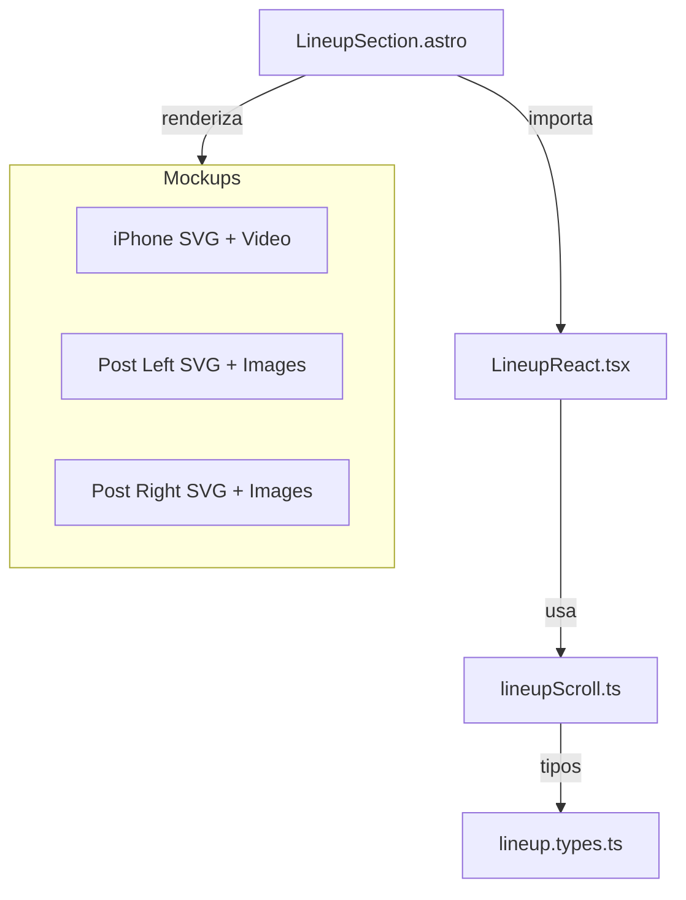

# Plano: Seção Line-up com Mockups Interativos

## Arquitetura da Solução

A seção será implementada seguindo a arquitetura de ilhas do Astro:

- **Componente Astro** (`.astro`) para estrutura estática e SVGs dos mockups
- **Componente React** (`.tsx`) para interatividade do scroll com `client:visible`
- **Script TypeScript** para lógica de scroll com RAF (requestAnimationFrame)



## 1. Estrutura de Arquivos

### Novos arquivos a serem criados:

```
src/
├── components/
│   ├── lineup/
│   │   ├── LineupReact.tsx          # Componente React com interatividade
│   │   └── lineup.types.ts          # Interfaces TypeScript
│   └── LineupSection.astro          # Componente Astro principal
├── scripts/
│   └── lineup/
│       └── lineupScroll.ts          # Lógica de scroll com RAF
└── i18n/
    └── locales/
        ├── pt-BR.json               # Adicionar traduções "lineup"
        ├── en.json                  # Adicionar traduções "lineup"
        └── es.json                  # Adicionar traduções "lineup"
```

## 2. Implementação dos Tipos

**Arquivo:** [`src/components/lineup/lineup.types.ts`](src/components/lineup/lineup.types.ts)

```typescript
export interface Artist {
  id: string;
  name: string;
  imageUrl: string;
  genre?: string;
}

export interface LineupProps {
  artists: Artist[];
  videoPlaceholder?: string;
  videoUrl?: string;
}

export interface ScrollProgress {
  progress: number; // 0 a 1
  currentArtistIndex: number;
}
```

## 3. Componente Principal Astro

**Arquivo:** [`src/components/LineupSection.astro`](src/components/LineupSection.astro)

**Características:**

- Import dos SVGs inline como strings (iPhone e Posts)
- Container com `position: relative` e altura adequada para scroll
- Grid/Flexbox responsivo: mobile (coluna) / desktop (3 colunas)
- Renderização do componente React com `client:visible`
- Styles usando Tailwind + CSS custom para posicionamento dos SVGs

**Estrutura HTML:**

```astro
<section id="lineup" class="lineup-section">
  <div class="lineup-container">
    <!-- Post Left Mockup -->
    <div class="lineup-mockup lineup-mockup--left">
      {/* SVG Post 1 com <image> interno para artista */}
    </div>

    <!-- iPhone Central Mockup -->
    <div class="lineup-mockup lineup-mockup--center">
      {/* SVG iPhone com <video> interno */}
    </div>

    <!-- Post Right Mockup -->
    <div class="lineup-mockup lineup-mockup--right">
      {/* SVG Post 1 com <image> interno para artista */}
    </div>
  </div>

  <!-- Componente React para interatividade -->
  <LineupReact client:visible artists={artists} />
</section>
```

**Cores a usar:**

- Background: `bg-stl-green-dark` ou gradiente com `bg-stl-indigo`
- Textos: `text-stl-cream`
- Destaques: `text-stl-gold`

## 4. Componente React com Framer Motion

**Arquivo:** [`src/components/lineup/LineupReact.tsx`](src/components/lineup/LineupReact.tsx)

**Características:**

- Usa `IntersectionObserver` para detectar quando seção está visível
- Chama `setupLineupScroll` do script TypeScript
- Gerencia estado do índice do artista atual
- Animações com Framer Motion para troca de imagens
- Respeita `prefers-reduced-motion`

**Estrutura React:**

```tsx
import { useEffect, useRef, useState } from 'react';
import { motion, AnimatePresence } from 'framer-motion';
import type { Artist } from './lineup.types';

export default function LineupReact({ artists }: { artists: Artist[] }) {
  const [currentIndex, setCurrentIndex] = useState(0);
  const sectionRef = useRef<HTMLDivElement>(null);

  useEffect(() => {
    // Setup scroll handler com RAF
    const cleanup = setupLineupScroll({
      onProgress: (progress) => {
        const newIndex = Math.floor(progress * (artists.length - 1));
        setCurrentIndex(newIndex);
      },
    });

    return cleanup;
  }, [artists]);

  // Renderiza imagens com AnimatePresence para transições suaves
}
```

## 5. Script de Scroll com RAF

**Arquivo:** [`src/scripts/lineup/lineupScroll.ts`](src/scripts/lineup/lineupScroll.ts)

**Características:**

- Usa `requestAnimationFrame` para performance (padrão do projeto)
- Calcula progresso baseado em scroll Y da viewport
- Flag `ticking` para throttle (padrão usado no hero)
- Callback para atualizar índice do artista

**Estrutura:**

```typescript
export interface LineupScrollOptions {
  onProgress: (progress: number) => void;
  threshold?: { start: number; end: number };
}

export function setupLineupScroll(options: LineupScrollOptions) {
  let ticking = false;

  const handleScroll = () => {
    if (!ticking) {
      requestAnimationFrame(() => {
        // Calcular progresso do scroll na seção
        const progress = calculateScrollProgress();
        options.onProgress(progress);
        ticking = false;
      });
      ticking = true;
    }
  };

  window.addEventListener('scroll', handleScroll, { passive: true });

  return () => window.removeEventListener('scroll', handleScroll);
}
```

## 6. Integração dos SVGs

### iPhone 16 Plus Dark

- Extrair `<svg>` de [`assets/img/mockup/iPhone 16 Plus Dark.svg`](assets/img/mockup/iPhone 16 Plus Dark.svg)
- Adicionar elemento `<foreignObject>` dentro do SVG para inserir `<video>`
- Coordenadas do `foreignObject`: `x="13.867" y="7.925" width="794.389" height="1654.15"`
- **Vídeo**: `/assets/videos/lineup.mp4` (loop, muted, autoplay)
- **Fallback/Poster**: `/assets/img/artistas/todos juntos/12.png`
- **Tamanho**: Ajustado para ser proporcional aos Posts laterais
  - Desktop: `max-width: 380px` (reduzido de 480px)
  - Tablet: `max-width: 280px` (reduzido de 320px)
  - Mobile: `max-width: 240px` (reduzido de 280px)

### Post 1 (Esquerda e Direita)

**IMPORTANTE**: Usar o SVG COMPLETO do mockup Post 1, incluindo TODOS os elementos de UI:

Elementos que DEVEM ser incluídos do SVG original:

1. **Cabeçalho** (linha 3): Path branco superior
2. **Logo do perfil** (linha 4): `<rect>` com `fill="url(#pattern0_1_273)"`
3. **Texto "stlfestival"** (linha 5): Path longo vetorizado com `fill="#181930"`
4. **Ícone de verificação** (linhas 6-7): Path azul `#42A5F5` com checkmark branco
5. **Footer** (linha 8): Path branco inferior
6. **Ícone Home** (linha 9): Path `#0C2322`
7. **Ícone Coração/Like** (linha 10): Path `#0C1014`
8. **Ícone Enviar/Avião** (linha 11): Path `#0C1014`
9. **Ícone Mensagem** (linha 12): Path `#0C2322`
10. **Defs completo**: Incluir `<filter>`, `<pattern>` e `<image>` (linhas 14-28)

**Apenas substituir**: A área de conteúdo do meio (entre cabeçalho e footer) com `<foreignObject>` para a imagem do artista:

- Posição: `x="39.8" y="119.776"`
- Tamanho: `width="377.249" height="525.85"`
- Conteúdo: `` do artista com transição suave

## 7. Internacionalização

Adicionar chaves nos arquivos JSON:

**[`src/i18n/locales/pt-BR.json`](src/i18n/locales/pt-BR.json)**

```json
{
  "lineup": {
    "title": "Line-up",
    "subtitle": "Artistas Confirmados",
    "sectionLabel": "Seção de artistas do festival",
    "artistLabel": "Artista: {name}",
    "scrollHint": "Role para ver mais artistas"
  }
}
```

Replicar para `en.json` e `es.json` com traduções adequadas.

## 8. Estilos e Responsividade

**Mobile (< 768px):**

- Layout em coluna (stack vertical)
- iPhone no topo, tamanho reduzido
- Posts esquerda/direita abaixo em grid 2 colunas
- Altura da seção: `min-h-[200vh]` para scroll adequado

**Tablet (768px - 1024px):**

- Grid 3 colunas proporcionais
- Mockups em tamanhos médios
- Altura: `min-h-[150vh]`

**Desktop (>= 1024px):**

**AJUSTES FINAIS (correção de proporção):**

- Grid: `auto auto auto` com `justify-content: center` e **`align-items: center`** (centraliza Posts verticalmente com iPhone)
- Posts: `max-width: 380px` (aumentados para melhor proporção visual)
- iPhone: `max-width: 480px` (mantém tamanho moderado)
- Gap: `var(--spacing-md)` (proximidade conforme referência)
- Posts com `position: sticky` e `top: 50%` + `transform: translateY(-50%)` para centralização vertical perfeita
- Altura: `min-h-[150vh]`

**Large Desktop (>= 1440px):**

- Posts: `max-width: 420px`
- iPhone: `max-width: 520px`
- Gap: `var(--spacing-lg)`

## 9. Acessibilidade

- `aria-label` na seção com título traduzido
- `role="region"` na seção
- `aria-live="polite"` para anunciar troca de artista
- Keyboard navigation (setas para trocar artistas)
- Respeitar `prefers-reduced-motion` (sem animações)
- Texto alternativo em todas as imagens

## 10. Performance

- Lazy load de imagens dos artistas (exceto primeira visível)
- `loading="lazy"` nos `<image>` SVG
- `will-change: transform` apenas durante animação
- Debounce de scroll com RAF (já implementado)
- Preload da primeira imagem de cada mockup

## 11. Dados dos Artistas

Criar array temporário no componente Astro:

```typescript
const artists: Artist[] = [
  {
    id: '1',
    name: 'Artista 1',
    imageUrl: 'https://res.cloudinary.com/[seu-cloud]/artists/artist-1.jpg',
    genre: 'Reggae',
  },
  // ... até 8 artistas
];
```

## Fluxo de Implementação

### Fase 0: Git Workflow

**Antes de iniciar qualquer implementação, criar uma nova branch:**

```bash
# Garantir que está na main atualizada
git checkout main
git pull origin main

# Criar e mudar para a nova branch
git checkout -b feat/lineup
```

**Convenções de commit durante o desenvolvimento:**

- Escopo: `lineup`
- Sem acentuação: `adiciona` ao invés de `adicioná`
- Exemplos:
  - `feat(lineup): adiciona estrutura base de componentes`
  - `feat(lineup): implementa scroll interativo com RAF`
  - `style(lineup): adiciona estilos responsivos`
  - `docs(lineup): adiciona documentacao dos componentes`

### Fase 1: Estrutura Base

1. Criar tipos em `lineup.types.ts`
2. Criar componente Astro com mockups estáticos
3. Adicionar traduções i18n

### Fase 2: Interatividade

4. Implementar script de scroll (`lineupScroll.ts`)
5. Criar componente React (`LineupReact.tsx`)
6. Integrar Framer Motion para animações

### Fase 3: Refinamento

7. Adicionar estilos responsivos
8. Implementar acessibilidade completa
9. Otimizar performance (lazy loading, preload)
10. Testar em diferentes dispositivos e navegadores

### Fase 4: Dados Reais

11. Substituir placeholders por imagens reais dos artistas
12. Adicionar vídeo real no mockup do iPhone (quando disponível)

## Arquivos a Modificar

- [`src/pages/index.astro`](src/pages/index.astro) - Adicionar `<LineupSection />`
- [`src/i18n/locales/pt-BR.json`](src/i18n/locales/pt-BR.json) - Traduções PT
- [`src/i18n/locales/en.json`](src/i18n/locales/en.json) - Traduções EN
- [`src/i18n/locales/es.json`](src/i18n/locales/es.json) - Traduções ES

## Considerações Técnicas

- **Git Workflow**:
  - Trabalhar em branch separada: `feat/lineup`
  - Branch derivada da `main` atualizada
  - Fazer commits incrementais e descritivos
  - Ao finalizar, criar PR para merge na `main`
- **Tailwind Config**: Usar cores já definidas (`stl-green`, `stl-gold`, etc)
- **TypeScript**: Strict mode ativado, tipar todas as props
- **Git Commits**: Usar Conventional Commits com escopo `lineup`
  - Exemplo: `feat(lineup): adiciona componente base com mockups`
- **Sem caracteres especiais** em mensagens de commit (usar `adiciona` ao invés de `adicioná`)

## Finalização

Após completar todas as fases:

1. Revisar todos os arquivos criados/modificados
2. Testar em diferentes dispositivos e navegadores
3. Verificar acessibilidade (teclado, screen readers, reduced motion)
4. Executar linting e type checking: `npm run lint` e `npm run type-check`
5. Fazer commit final: `feat(lineup): finaliza implementacao da secao lineup`
6. Push da branch: `git push origin feat/lineup`
7. Criar Pull Request para merge na `main`
