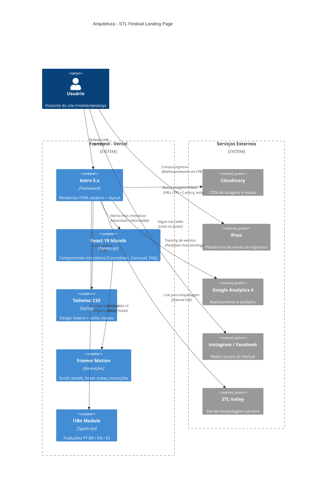
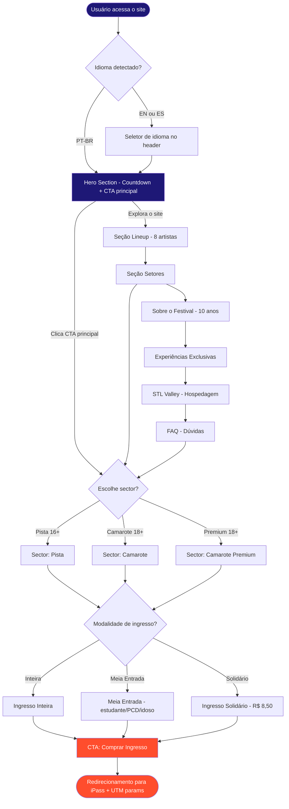
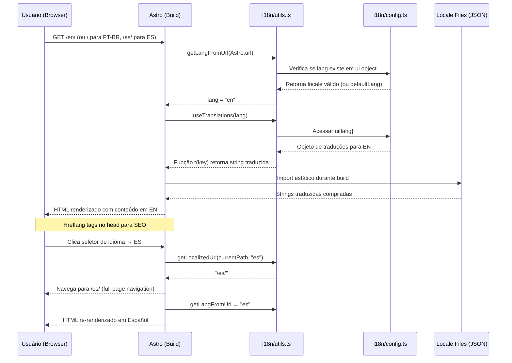
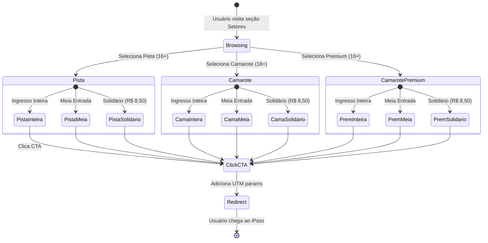

```mermaid
graph TB
    subgraph Layout["BaseLayout.astro"]
        Header["Header.astro\n(Nav + LanguageSelector)"]
        Main["index.astro\n(Página Principal)"]
        Footer["Footer.astro\n(Links + Badges)"]
    end

    subgraph Static["Componentes Estáticos - Astro (sem JS)"]
        Hero["Hero.astro\n(Headline + Info)"]
        Lineup["Lineup.astro\n(8 artistas)"]
        Setores["Setores.astro\n(3 sectors)"]
        About["About.astro\n(10 anos)"]
        Accessibility["Accessibility.astro"]
        Sustainability["Sustainability.astro"]
        Diversity["Diversity.astro"]
        Experiences["Experiences.astro\n(Tirolesa + Translado)"]
        Valley["Valley.astro\n(STL Valley)"]
        iPassInfo["iPassInfo.astro"]
    end

    subgraph Interactive["Componentes Interativos - React Islands"]
        Countdown["CountdownTimer.jsx\n(client:load)\nContagem regressiva"]
        Carousel["Carousel.jsx\n(client:visible)\nCarrossel de setores"]
        FAQ["FAQ.jsx\n(client:visible)\nAcordeão"]
    end

    subgraph Shared["Compartilhados"]
        Tokens["Design Tokens\n(tokens.css)"]
        I18n["i18n Module\n(pt-BR / en / es)"]
        Cloudinary["Cloudinary Utils\n(URLs otimizadas)"]
    end

    Main --> Header
    Main --> Hero
    Main --> Lineup
    Main --> Setores
    Main --> About
    Main --> Accessibility
    Main --> Sustainability
    Main --> Diversity
    Main --> Experiences
    Main --> Valley
    Main --> iPassInfo
    Main --> FAQ
    Main --> Footer

    Hero --> Countdown
    Setores --> Carousel

    Header --> I18n
    Hero --> Tokens
    Lineup --> Cloudinary
    Setores --> Tokens

    style Static fill:#fefbdf,stroke:#006a47
    style Interactive fill:#1e1876,color:#fff,stroke:#007b9a
    style Shared fill:#007b9a,color:#fff
```

# Diagramas Arquiteturais - STL Festival Landing Page

## Informações do Documento

- **Data de Criação:** 28 de Janeiro de 2026
- **Versão:** 1.0
- **Fonte:** Briefing (02), PRD (03), Tech Stack (04), Design System (05), i18n (07)
- **Status:** Documentação visual completa

---

## Diagramas Identificados

| #   | Diagrama                     | Tipo              | Objetivo                                       |
| --- | ---------------------------- | ----------------- | ---------------------------------------------- |
| 1   | Arquitetura do Sistema       | C4 Container      | Stack completo e integrações                   |
| 2   | Fluxo do Usuário (Conversão) | Flowchart         | Jornada até o clique no iPass                  |
| 3   | Estrutura de Componentes     | Component Diagram | Astro (estático) vs React Islands (interativo) |
| 4   | Fluxo de i18n                | Sequence Diagram  | Detecção e troca de idioma                     |
| 5   | Estados dos Setores/Tickets  | State Diagram     | Escolha de sector e modalidade                 |
| 6   | Pipeline de Deploy           | Flowchart         | Código até produção no Vercel                  |

---

## 1. Arquitetura do Sistema (C4 Container)

**Tipo:** Arquitetura C4 Container

**Objetivo:** Representar a arquitetura completa do sistema de landing page, mostrando como os componentes se relacionam com serviços externos.

### Descrição Conceitual

Diagrama C4 que mapeia todos os containers do sistema: o frontend hospedado no Vercel (Astro estático + React Islands para interatividade), os serviços externos consumidos (Cloudinary para assets, iPass para vendas, GA4 para analytics) e os módulos internos (i18n, design tokens). Evidencia a Islands Architecture como decisão central do projeto.

### Elementos Principais

- **Atores:** Usuário (mobile/desktop)
- **Componentes internos:** Astro 5.x, React 19 Islands, Tailwind CSS, Framer Motion, i18n Module
- **Serviços externos:** Cloudinary (CDN), iPass (vendas), Google Analytics 4, Instagram/Facebook, STL Valley

### Fluxo / Relações

1. Usuário acessa o site hospedado no Vercel via HTTPS
2. Astro entrega HTML estático (zero JS por padrão)
3. React Islands hidratam apenas componentes que precisam de interatividade (client:load / client:visible)
4. Imagens e vídeos são servidos pelo Cloudinary via CDN com otimização automática (f_auto, q_auto)
5. CTAs redirecionam o usuário para o iPass com UTM parameters
6. Analytics são rastreados de forma não-bloqueante via Partytown + GA4
7. Links nas redes sociais e STL Valley direcionam para sites externos

### Diagrama



---

## 2. Fluxo do Usuário (Conversão)

**Tipo:** Flowchart

**Objetivo:** Mapear a jornada completa do usuário desde a entrada no site até a conversão (clique no iPass), incluindo os diferentes caminhos e decisão de ingresso.

### Descrição Conceitual

Flowchart que documenta todos os caminhos que um usuário pode percorrer no site. Parte da entrada (com detecção de idioma), passa pelo Hero e suas seções de conteúdo, e converge para a decisão de compra: escolha de sector e modalidade de ingresso, culminando no redirecionamento para o iPass.

### Elementos Principais

- **Entrada:** Acesso ao site com detecção de idioma
- **Seções:** Hero, Lineup, Setores, About, Experiências, Valley, FAQ
- **Decisões:** Sector (Pista/Camarote/Premium), Modalidade (Inteira/Meia/Solidário)
- **Saída:** Redirecionamento para iPass com UTM tracking

### Fluxo / Relações

1. Usuário chega ao site; sistema detecta idioma pela URL
2. Hero apresenta evento com CTA principal e contagem regressiva
3. Usuário pode explorar seções (Lineup, Setores, About, etc.) ou diretamente clicar no CTA
4. Na decisão de compra, seleciona sector e modalidade
5. CTA final redireciona para iPass com parâmetros UTM
6. Solidário disponível para jovens 15-29 com CadÚnico
7. Meia entrada requer documento (estudante/PCD/idoso 60+)

### Diagrama



---

## 3. Estrutura de Componentes

**Tipo:** Component Diagram

**Objetivo:** Separar claramente os componentes estáticos (Astro, sem JS) dos componentes interativos (React Islands), refletindo a Islands Architecture que fundamenta a decisão de stack do projeto.

### Descrição Conceitual

Diagrama que organiza todos os componentes da landing page em três camadas: componentes estáticos Astro (renderizados como HTML puro), componentes interativos React (ilhas que hidratam com JS), e módulos compartilhados (design tokens, i18n, Cloudinary utils). Evidencia que cerca de 90% da página é HTML/CSS e apenas 10% usa JavaScript.

### Elementos Principais

- **Layout:** BaseLayout.astro (wrapa toda a página)
- **Estáticos (Astro):** Hero, Lineup, Setores, About, Accessibility, Sustainability, Diversity, Experiences, Valley, iPassInfo, Footer
- **Interativos (React Islands):** CountdownTimer (client:load), Carousel (client:visible), FAQ Accordion (client:visible)
- **Compartilhados:** Design Tokens, i18n Module, Cloudinary Utils

### Fluxo / Relações

1. BaseLayout.astro define estrutura da página (Header + Main + Footer)
2. index.astro compõe todas as seções na ordem definida no PRD
3. Componentes estáticos são renderizados diretamente no HTML durante o build
4. React Islands são injetados com directivas de hidratação (client:load para críticos, client:visible para abaixo da dobra)
5. Todos os componentes consumem design tokens via Tailwind CSS
6. i18n Module fornece function t() para strings traduzidas
7. Cloudinary Utils gera URLs otimizadas para imagens e vídeos

### Diagrama



---

## 4. Fluxo de i18n (Sequence Diagram)

**Tipo:** Sequence Diagram

**Objetivo:** Documentar como o sistema de internacionalização funciona: desde a detecção do idioma até a renderização de conteúdo traduzido, incluindo o fluxo de troca de idioma pelo usuário.

### Descrição Conceitual

Diagrama de sequência que mostra a comunicação entre os módulos do sistema i18n durante o build do Astro e durante a interação do usuário. Evidencia que a resolução de idioma é feita em build-time (não em runtime), resultando em páginas estáticas por idioma já com todo o conteúdo traduzido.

### Elementos Principais

- **Usuário:** Faz requisição HTTP e interage com seletor de idioma
- **Astro:** Framework que executa o build e renderiza pages
- **i18n Utils:** Funções getLangFromUrl, useTranslations, getLocalizedUrl
- **i18n Config:** Objeto ui com todas as strings por locale
- **Locale Files:** JSON com tradução completa por idioma

### Fluxo / Relações

1. Usuário acessa URL com prefixo de idioma (ex: /en/)
2. getLangFromUrl extrai o idioma da URL
3. Verifica se o locale existe no objeto de configuração
4. useTranslations retorna função t() tipada para o locale
5. Componentes usam t(key) para renderizar strings traduzidas
6. Troca de idioma navega para nova URL (full page navigation, sem client-side routing)
7. Hreflang tags são injetadas no head para SEO multilíngue
8. PT-BR é o default (raiz /); EN e ES usam subdiretórios (/en/, /es/)

### Diagrama



---

## 5. Estados dos Setores/Tickets (State Diagram)

**Tipo:** State Diagram

**Objetivo:** Representar os estados que um processo de compra de ingresso passa desde a visualização dos setores até a conclusão da compra no iPass, incluindo as modalidades disponíveis para cada sector.

### Descrição Conceitual

State diagram que mapeia os estados possíveis durante a decisão de compra de ingresso. Cada sector (Pista, Camarote, Camarote Premium) oferece as três modalidades de ingresso (Inteira, Meia Entrada, Solidário). O estado final é o redirecionamento para o iPass com parâmetros UTM.

### Elementos Principais

- **Estado inicial:** Browsing (visualizando seção Setores)
- **Setores:** Pista (16+), Camarote (18+), Camarote Premium (18+)
- **Modalidades:** Inteira (valor cheio), Meia Entrada (40% dos ingressos), Solidário (R$ 8,50 mínimo)
- **Estado final:** Redirecionamento para iPass

### Fluxo / Relações

1. Usuário começa no estado Browsing ao visitar seção Setores
2. Seleciona um dos três setores disponíveis
3. Dentro de cada sector, escolhe a modalidade de ingresso
4. Meia entrada disponível para estudante, PCD, professor, idoso 60+
5. Solidário disponível para jovens 15-29 com CadÚnico (doação mínima R$ 8,50)
6. Após seleção, clica CTA que adiciona UTM params e redireciona para iPass
7. Estado final é externo ao sistema (usuário sai da landing page)

### Diagrama



---

## 6. Pipeline de Deploy (Flowchart)

**Tipo:** Flowchart

**Objetivo:** Documentar o fluxo completo desde a edição de código até o deploy em produção, seguindo o Git Flow proposto na metodologia do projeto.

### Descrição Conceitual

Flowchart que mapeia o pipeline de desenvolvimento e deploy do projeto. Segue a estrutura de branches proposta (main + feature/section-\*), passa pelo CI com type-check e build do Astro, e culmina no deploy automático no Vercel. Inclui os pontos de feedback (erros de tipo, erros de build, code review) que impedem o progresso até serem resolvidos.

### Elementos Principais

- **Desenvolvimento:** Branches feature/section-[nome]
- **CI:** GitHub Actions com type-check (TypeScript strict) + Astro build
- **Review:** Pull Request com deploy preview no Vercel
- **Deploy:** Merge para main → deploy automático em produção
- **Pontos de retorno:** Erros de tipo, erros de build, mudanças no review

### Fluxo / Relações

1. Desenvolvedor trabalha em branch feature/section-[nome]
2. Push dispara CI no GitHub Actions
3. TypeScript type-check (strict mode) valida tipos
4. Se houver erro de tipo, retorna ao desenvolvimento
5. Se OK, Astro build gera HTML estático otimizado
6. Se houver erro de build, retorna ao desenvolvimento
7. PR é criado e Vercel gera deploy preview com URL temporária
8. Code review + QA no preview
9. Se houver mudanças solicitadas, retorna ao desenvolvimento
10. Se aprovado, merge para main dispara deploy automático em produção
11. Monitoring via Analytics + Performance monitoring

### Diagrama

```mermaid
flowchart TD
    Dev[Desenvolvimento local\nbranch: feature/section-hero] --> Push[git push origin feature/section-hero]

    Push --> CI{GitHub Actions CI}

    CI --> TypeCheck[npm run type-check\n(TypeScript strict)]
    TypeCheck -->|Erro| FixCode[Corrigir erros de tipo]
    FixCode --> Dev

    TypeCheck -->|OK| Build[npm run build\n(Astro build)]
    Build -->|Erro| FixBuild[Corrigir erro de build]
    FixBuild --> Dev

    Build -->|OK| PR[Criar Pull Request]

    PR --> Preview[Vercel Deploy Preview\nURL temporária para review]
    Preview --> Review{Code Review + QA}

    Review -->|Mudanças| FixReview[Ajustes baseados no review]
    FixReview --> Dev

    Review -->|Aprovado| Merge[Merge para main]

    Merge --> ProdBuild[Vercel Build Production\n(Astro SSG → HTML estático)]
    ProdBuild --> ProdDeploy[Deploy em Produção\nstlfestival.com.br]

    ProdDeploy --> Monitor[Monitoring\n(Analytics + Performance)]

    style Dev fill:#1e1876,color:#fff
    style CI fill:#ff9d28,color:#000
    style ProdDeploy fill:#006a47,color:#fff
    style Preview fill:#007b9a,color:#fff
```

---

## Checklist de Qualidade

- [x] Títulos claros e auto-explicativos
- [x] Elementos principais identificados
- [x] Fluxos/sequências lógicos
- [x] Sintaxe Mermaid correta
- [x] Nomenclatura consistente com docs (PRD, Briefing, Tech Stack)
- [x] Abstração apropriada (mix de high-level e detalhado)
- [x] Baseia-se exclusivamente na documentação do projeto
- [x] Sem componentes ou fluxos inventados

---

**Versão:** 1.0
**Data:** 28 de Janeiro de 2026
**Fonte:** Documentação do projeto (02-BRIEFING, 03-PRD, 04-TECH-STACK-ANALYSIS, 05-DESIGN-SYSTEM, 07-INTERNATIONALIZATION)
